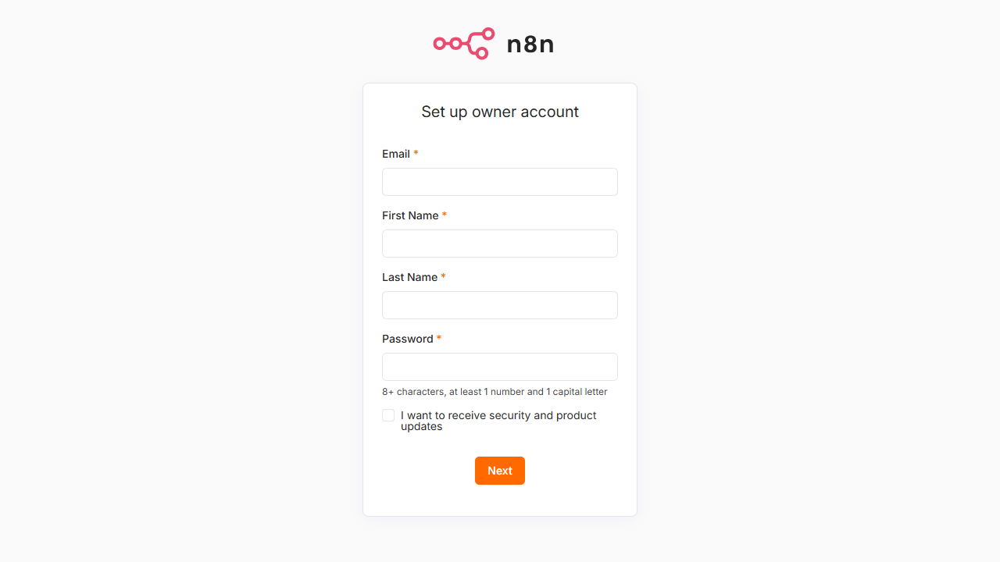
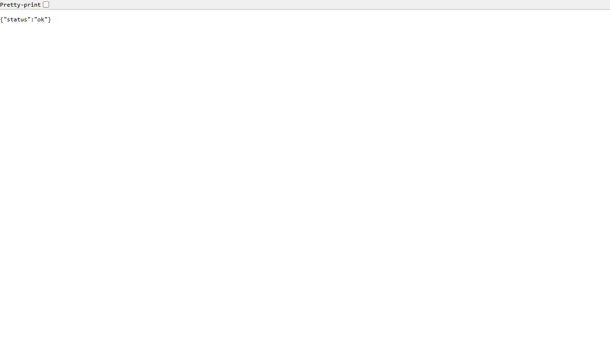

# FoodFlow — Nền tảng Giao đồ ăn Realtime

<p align="center">
  
  
  
  
  
  
  
  
</p>

Hệ thống giao đồ ăn thời gian thực gồm 4 ứng dụng: Customer App, Driver App, Restaurant Dashboard, Admin Dashboard. Hỗ trợ realtime GPS tracking, AI assistant, và driver dispatch tự động.

## Tính năng

- **Khách hàng**: Tìm nhà hàng gần (PostGIS), đặt món, theo dõi tài xế realtime trên bản đồ, chat AI
- **Tài xế**: Nhận đơn, GPS background, navigation, xem thu nhập
- **Nhà hàng**: Nhận đơn realtime, quản lý menu, xem doanh thu
- **Admin**: Dashboard KPI, bản đồ tài xế realtime, quản lý user/nhà hàng/khuyến mãi, audit log
- **AI Assistant**: Chat hỗ trợ khách (N8N + Gemini), phát hiện đơn trễ, báo cáo hàng ngày
- **Realtime**: WebSocket GPS tracking, Socket.IO Redis adapter, throttled broadcast

## Kiến trúc

```
mobile/ (Flutter)    web/ (Next.js)       backend/ (NestJS)     infra/ (Docker, N8N, Nginx)
  ├── customer         ├── admin             ├── auth             ├── docker-compose.yml
  └── driver           └── restaurant        ├── orders           ├── nginx/nginx.conf
                                              ├── dispatch        └── n8n/workflows/
                                              ├── tracking
                                              ├── restaurants
                                              └── drivers
```

## Quick Start

```bash
# 1. Cơ sở hạ tầng
docker compose up -d

# 2. Backend
cd backend
pnpm install && pnpm prisma generate
pnpm prisma migrate dev --name init
pnpm db:seed        # Dữ liệu mẫu nhỏ
# pnpm db:big-seed  # Dữ liệu lớn (50 nhà hàng, 100 khách, 500 đơn)

pnpm start:dev       # http://localhost:3001/api

# 3. Web Dashboard
cd web && pnpm install && pnpm dev
# Admin:  http://localhost:3002
# Restaurant: http://localhost:3003

# 4. Mobile App
cd mobile && flutter pub get
flutter run -t lib/main_customer.dart
flutter run -t lib/main_driver.dart
```

## Docker Hub

```bash
docker pull nguyenson1710/foodflow-backend:latest
docker pull nguyenson1710/foodflow-postgres:latest
```

## Tài khoản test

| Vai trò | Email | Mật khẩu |
|---------|-------|----------|
| Admin | admin@foodflow.vn | Admin@123 |
| Khách hàng | customer1@foodflow.vn | Customer@123 |
| Tài xế | driver1@foodflow.vn | Driver@123 |
| Nhà hàng | restaurant1@foodflow.vn | Partner@123 |

## Screenshots

| N8N AI Automation | Health Check |
|-------------------|-------------|
|  |  |

## Tài liệu

- [Kiến trúc hệ thống](docs/system-architecture.md)
- [API Reference](docs/api-reference.md)
- [Deployment Guide](docs/deployment-guide.md)
- [Code Standards](docs/code-standards.md)
- [Design Guidelines](docs/design-guidelines.md)
- [Testing Guide](docs/testing-guide.md)
- [N8N Setup Guide](docs/n8n-setup-guide.md)
- [Roadmap](docs/project-roadmap.md)
- [Kế hoạch phát triển](plans/260604-foodflow-system-design/plan.md)

## License

MIT © 2026 Nguyen Tien Son
