# FoodFlow Deployment Guide

## Purpose

This runbook deploys the managed-production topology:

- Supabase: PostgreSQL/PostGIS, Realtime, Storage.
- Vercel: NestJS API, Admin Next.js, Restaurant Next.js.
- Docker Hub: immutable multi-architecture release artifacts after production smoke.

It does not authorize deployment while secrets, CLI access, current-head tests, remote CI, or production health are incomplete. Local green checks are necessary but not a substitute for provider and remote release approval.

## Release invariants

1. Work only from the isolated clean integration worktree; never modify `D:\Food_Delivery`.
2. Keep `master` as the only remote branch. Do not push the local integration branch by name.
3. Rotate any credential previously exposed in chat, logs, screenshots, tickets, or git history.
4. Enter values through secure local prompts or provider dashboards; never paste values into docs or commits.
5. Use explicit Supabase providers in managed production; no implicit Socket.IO/MinIO/BullMQ fallback.
6. Migrate the database before deploying an API that requires the new schema.
7. Deploy API before web because web builds bake the verified API alias.
8. Promote immutable Docker tags only after production smoke; `latest` is never an initial release tag.

## Release stages

```mermaid
flowchart LR
    A["Clean source + full local gates"] --> B["Fresh green GitHub Actions"]
    B --> C["Rotated secrets + preflights"]
    C --> D["Supabase migration/RLS/Realtime/Storage"]
    D --> E["Vercel API"]
    E --> F["Vercel Admin + Restaurant"]
    F --> G["Production health + authenticated smoke"]
    G --> H["Fast-forward master"]
    H --> I["Docker SHA → semver → manual latest"]
```



Any failed stage stops later stages.

## Prerequisites

- Node.js 22.13+, Corepack, pnpm 11.11.0.
- Docker with Buildx/QEMU for local image verification.
- Flutter SDK for the mobile gate.
- Vercel CLI authenticated to the account that owns all three projects.
- Supabase CLI access token scoped to the target project.
- GitHub Actions billing/auth restored.
- Rotated production credentials for database, JWT, Maps/routing, DeepSeek, SePay, notifications, messaging, and deployments.

Expected Vercel projects:

| Project | Root directory | Framework/build |
|---|---|---|
| `foodflow-api` | `backend` | Other; `pnpm prisma generate && pnpm build` |
| `food-delivery-app` | `web/apps/admin` | Next.js; workspace-filtered build |
| `foodflow-restaurant` | `web/apps/restaurant` | Next.js; workspace-filtered build |

Project IDs and generated `.vercel/` files are not documentation contracts. The preflight verifies live settings by project name.

## 1. Source and test gate

From the integration worktree:

```powershell
git fetch --prune origin
git status --short
git rev-list --left-right --count origin/master...HEAD
powershell -NoProfile -ExecutionPolicy Bypass -File infra/scripts/local-release-gate.ps1 -RunE2E
```

Required additional evidence:

- Fresh database applies all migrations.
- Playwright Chromium + Firefox full suite.
- axe serious/critical = 0 and visual regression accepted.
- Tenant isolation and realtime channel authorization.
- Shipper GPS/route/ETA map smoke with real provider geometry.
- DeepSeek fail-closed test and live smoke using a newly rotated key.
- Secret scan for tracked files and staged diff.
- Multi-arch runtime smoke and High/Critical image scan.
- Flutter analyze/test after mobile Supabase realtime migration.

Do not continue until current-head GitHub workflows are also green.

## 2. Secure credential entry

### Supabase release shell

The helper reads secret values through local PowerShell prompts, keeps them process-scoped, runs preflight, then clears them:

```powershell
powershell -NoProfile -ExecutionPolicy Bypass \
  -File infra/scripts/supabase-env-prompt.ps1 -RunPreflight
```

Required shell names:

- `SUPABASE_ACCESS_TOKEN`
- `SUPABASE_PROJECT_REF`
- `DATABASE_URL` — pooled transaction-mode runtime URL
- `DIRECT_URL` — direct/session migration URL

The script rejects local database URLs and verifies that the authenticated account can see the project.

### Vercel production variables

First list live gaps without printing values:

```powershell
powershell -NoProfile -ExecutionPolicy Bypass -File infra/scripts/vercel-web-preflight.ps1
```

Then prompt only for reported missing names. Example command shape:

```powershell
powershell -NoProfile -ExecutionPolicy Bypass \
  -File infra/scripts/vercel-env-prompt.ps1 \
  -Project api -Names DATABASE_URL,DIRECT_URL -PromptValues
```

Repeat for Admin/Restaurant missing names, then rerun preflight. The helper marks server secrets sensitive and browser-safe values non-sensitive; it does not write dotenv files.

## 3. Production environment contract

### API (`foodflow-api`)

Core/provider values:

| Name | Production rule |
|---|---|
| `NODE_ENV` | `production` |
| `DATABASE_URL` | Supabase pooled runtime URL |
| `DIRECT_URL` | Supabase direct/session migration URL |
| `REDIS_URL` | Current API contract still requires a managed production Redis endpoint for remaining cache/history paths; never point at localhost |
| `REALTIME_PROVIDER` | `supabase` |
| `STORAGE_PROVIDER` | `supabase` |
| `QUEUE_PROVIDER` | `supabase-postgres` |
| `SUPABASE_URL` | Project HTTPS origin |
| `SUPABASE_SERVICE_ROLE_KEY` | Server-only, sensitive |
| `SUPABASE_JWT_SECRET` | Server-only signing secret for scoped realtime JWTs |
| `SUPABASE_STORAGE_BUCKET` | Explicit production bucket |
| `CRON_SECRET` | Strong bearer secret for `/api/jobs/drain` |

Application/security values:

- `JWT_SECRET`, `JWT_REFRESH_SECRET`
- `PASSWORD_RESET_URL_BASE`, `CORS_ORIGINS`, `DELIVERY_BASE_FEE_VND`
- `GOOGLE_MAPS_API_KEY`, `OSRM_URL`
- `DEEPSEEK_API_KEY` and optional `DEEPSEEK_MODEL=deepseek-v4-flash`
- `SEPAY_API_KEY`, `SEPAY_ACCOUNT_NUMBER`, `SEPAY_WEBHOOK_SECRET`, `WEBHOOK_SECRET`
- `SMTP_HOST`, `SMTP_USER`, `SMTP_PASS`, `SMTP_FROM`
- `FCM_SERVER_KEY`
- `TWILIO_ACCOUNT_SID`, `TWILIO_AUTH_TOKEN`, `TWILIO_FROM_NUMBER`

`CORS_ORIGINS` must contain only verified Admin/Restaurant HTTPS origins. `PASSWORD_RESET_URL_BASE` must use the verified Admin origin. Do not add wildcard CORS.

### Admin

- `NEXT_PUBLIC_API_URL=https://<verified-api-alias>.vercel.app/api`
- `NEXT_PUBLIC_ADMIN_URL=https://<verified-admin-alias>.vercel.app`
- `NEXT_PUBLIC_GOOGLE_MAPS_KEY=<origin/API-restricted browser key>`
- `NEXT_PUBLIC_REALTIME_PROVIDER=supabase`
- `NEXT_PUBLIC_SUPABASE_URL=https://<project>.supabase.co`
- `NEXT_PUBLIC_SUPABASE_ANON_KEY=<public anon key, origin/RLS constrained>`

### Restaurant

Same as Admin, replacing `NEXT_PUBLIC_ADMIN_URL` with `NEXT_PUBLIC_RESTAURANT_URL`.

Public variables are baked into Next.js assets. Changing them requires a rebuild/redeploy. “Public” does not mean unrestricted: Maps and Supabase policies must still enforce origins and row access.

## 4. Supabase deployment

### Validate and migrate

After every release gate is green and the prompted preflight passes:

```powershell
cd backend
corepack pnpm exec prisma validate --schema prisma/schema.prisma
corepack pnpm run db:migrate:prod
cd ..
```

Use `DIRECT_URL` for migration safety; do not run `prisma migrate dev`, reset, or a demo seed against production.

### Verify schema and security

Run read-only checks through the Supabase SQL editor or approved CLI session:

```sql
select count(*) from prisma_migrations;

select tablename, rowsecurity
from pg_tables
where schemaname = 'public'
  and tablename in ('realtime_outbox', 'job_outbox', 'ai_usage_events');

select pubname, schemaname, tablename
from pg_publication_tables
where pubname = 'supabase_realtime';

select policyname, tablename, roles, cmd
from pg_policies
where schemaname = 'public'
  and tablename in ('realtime_outbox', 'job_outbox', 'ai_usage_events');
```

Expected invariants:

- All 22 repository migrations are applied in order.
- `realtime_outbox`, `job_outbox`, and `ai_usage_events` have RLS enabled.
- `realtime_outbox` is in `supabase_realtime`; unrelated business tables are not broadly added merely for convenience.
- Authenticated outbox reads are limited by the JWT `realtime_channels` claim.
- Service-role access is separate; anon cannot read the outbox/job/AI telemetry tables.
- The storage bucket exists with the intended privacy policy; no service-role key is present in browser output.

### Realtime smoke

Using a short-lived authenticated application token in a secure shell:

1. Request `POST /api/realtime/token` for a known order/restaurant.
2. Confirm all returned channels start with `private:`.
3. Confirm an authorized event reaches the subscribed client.
4. Confirm another tenant cannot obtain or read that channel.
5. Confirm expired/invalid JWTs cannot subscribe.

## 5. Vercel API deployment

Rerun Vercel preflight, then deploy a preview first:

```powershell
vercel --cwd backend
```

Validate preview health and function logs. Promote only the tested deployment:

```powershell
vercel --prod --cwd backend
```

Record the verified API alias. Confirm:

- `GET https://<api>/api/healthz` returns JSON with `status: ok`.
- `GET https://<api>/api/readyz` reports required dependencies ready.
- Vercel Cron targets `/api/jobs/drain?limit=50` and authenticates with `CRON_SECRET`.
- Logs do not print environment values, bearer tokens, database URLs, or provider payload secrets.

If health is degraded/down, stop. Do not deploy web against a failing API.

## 6. Admin and Restaurant deployment

Update both projects to the verified API alias, rerun preflight, then deploy previews:

```powershell
vercel --cwd web/apps/admin
vercel --cwd web/apps/restaurant
```

Run locale/login/dashboard checks on each preview. Promote the exact tested deployments:

```powershell
vercel --prod --cwd web/apps/admin
vercel --prod --cwd web/apps/restaurant
```

Required web checks:

- `/vi/login`, `/en/login`, `/ja/login` return real pages, correct title, and matching `html lang`.
- `/api/healthz` returns `status: ok`.
- No Vercel/Next.js 404 shell.
- No console error, mixed-content request, localhost call, or legacy production socket fallback.
- Maps key is origin restricted and the app subscribes through Supabase when configured.

## 7. Production smoke

First run unauthenticated health probes:

```powershell
$env:API_URL='https://<api-alias>'
$env:ADMIN_URL='https://<admin-alias>'
$env:RESTAURANT_URL='https://<restaurant-alias>'
powershell -File infra/scripts/production-health-check.ps1
```

Then provide short-lived smoke tokens only through process environment and run the authenticated contracts:

```powershell
$env:FOODFLOW_ADMIN_TOKEN='<short-lived-token>'
$env:FOODFLOW_CUSTOMER_TOKEN='<short-lived-token>'
$env:FOODFLOW_RESTAURANT_TOKEN='<short-lived-token>'
$env:FOODFLOW_DRIVER_TOKEN='<short-lived-token>'
$env:FOODFLOW_SMOKE_ORDER_ID='<authorized-order-uuid>'
$env:FOODFLOW_SMOKE_RESTAURANT_ID='<authorized-restaurant-uuid>'
powershell -File infra/scripts/post-deploy-smoke.ps1 \
  -RequireAuthenticatedChecks -RequireRoutePolyline -CreateExportJob
```

The script never prints bearer values. Clear all process tokens afterward.

Smoke must cover:

- API/Admin/Restaurant health and localized login pages.
- Supabase realtime token/channel authorization and delivery.
- DeepSeek live answer or intentional escalation; degraded is not accepted for production.
- Admin export list/create/download contract.
- Shipper route snapshot with real route phase and provider polyline.
- Cross-tenant denial.
- SePay webhook verification/replay behavior, notification delivery, and storage upload.

## 8. Fast-forward and Docker publication

After production smoke and fresh remote CI are green:

```powershell
git fetch --prune origin
git status --short
git merge-base --is-ancestor origin/master HEAD
git push origin HEAD:master
git fetch --prune origin
git rev-list --left-right --count origin/master...HEAD
git ls-remote --heads origin
```

Expected final comparison: `0 0`; expected remote heads: `master` only.

Create/push `v4.0.0` only at the verified master commit. The Docker workflow publishes SHA manifests, smokes/scans both architectures, verifies production health, and then creates the immutable semver manifest. `latest` promotion is a separate manual dispatch.

Do not publish the historical `foodflow-worker` image; the backend image contains the worker entry point.

## Self-hosted Docker compatibility

This is not the Supabase/Vercel production topology. Use only with fully supplied self-hosted secrets:

```powershell
Copy-Item .env.production.example .env.production
$env:IMAGE_TAG='v4.0.0' # or sha-<full-commit>
docker compose --env-file .env.production \
  -f docker-compose.yml -f docker-compose.prod.yml pull
docker compose --env-file .env.production \
  -f docker-compose.yml -f docker-compose.prod.yml up -d
```

The overlay explicitly selects Socket.IO, MinIO, and BullMQ. Never use its example values unchanged.

## Rollback

1. Stop traffic-changing actions and preserve logs/health evidence without secrets.
2. Vercel: roll back each project to its last verified deployment.
3. Database: prefer a forward corrective migration. Restore backup only under an approved data-loss/recovery procedure.
4. Realtime/storage: restore the last verified RLS/publication/bucket policy; never disable RLS as a shortcut.
5. Docker self-hosted: set `IMAGE_TAG` to the previous immutable semver/SHA digest and recreate services.
6. Rerun health and authenticated smoke before declaring recovery.

## Abort conditions

Do not deploy or promote when any of these is true:

- Dirty release worktree or diverged/non-fast-forward history.
- Missing/expired CLI auth, secret, signing key, or required environment name.
- Previously exposed key has not been rotated.
- Current-head local or remote gate is red/missing.
- RLS/publication/tenant isolation cannot be proven.
- API/Web health, map route, realtime, chatbot, export, payment, or notification smoke fails.
- Docker manifest has not passed both architectures or contains High/Critical vulnerabilities.
- A target semver tag already exists with a different digest.

See [testing guide](testing-guide.md), [security guide](security-audit-guide.md), and [release report](batch4-release-report.md).
