# FoodFlow Deployment Guide

## Purpose

This runbook deploys the managed-production topology:

- Supabase: PostgreSQL/PostGIS, Realtime, Storage.
- Railway: NestJS API, worker, one-off Prisma migrator, managed Redis.
- Vercel: Admin Next.js and Restaurant Next.js.
- Docker Hub: immutable multi-architecture release artifacts after production smoke.

It does not authorize deployment while secrets, CLI access, current-head tests, remote CI, or production health are incomplete. Local green checks are necessary but not a substitute for provider and remote release approval.

For the latest verified rollout, use [Production Current State](./production-current-state.md). It records the split Railway/Vercel revisions, immutable image digest, health evidence, quota boundary, and rollback image. The historical release evidence below remains useful for provenance but must not be treated as the current Railway revision.

## Release invariants

1. Work only from a clean, approved release worktree.
2. Keep `master` as the only remote branch. Do not recreate or push historical integration branches by name.
3. Rotate any credential previously exposed in chat, logs, screenshots, tickets, or git history.
4. Enter values through secure local prompts or provider dashboards; never paste values into docs or commits.
5. Use explicit Supabase providers in managed production; no implicit Socket.IO/MinIO/BullMQ fallback.
6. Migrate the database before deploying an API that requires the new schema.
7. Deploy API before web because web builds bake the verified API alias.
8. Promote immutable Docker tags only after production smoke; `latest` is never an initial release tag.
9. Store `NEXT_PUBLIC_*` values as auditable Vercel encrypted/plain variables, not non-readable `sensitive` values; verify the built bundles contain no localhost or tunnel origin.

## Release stages

```mermaid
flowchart LR
    A["Clean source + full local gates"] --> B["Fresh green GitHub Actions"]
    B --> C["Rotated secrets + preflights"]
    C --> D["Supabase migration/RLS/Realtime/Storage"]
    D --> E["Railway migrate + API/worker/Redis"]
    E --> F["Vercel Admin + Restaurant"]
    F --> G["Production health + authenticated smoke"]
    G --> H["Verify deployed master"]
    H --> I["Docker SHA → semver → manual latest"]
```



Any failed stage stops later stages.

## Prerequisites

- Node.js 22.13+, Corepack, pnpm 11.11.0.
- Docker with Buildx/QEMU for local image verification.
- Flutter SDK for the mobile gate.
- Railway CLI authenticated to the account that owns the production project.
- Vercel CLI authenticated to the account that owns both dashboard projects.
- Supabase CLI access token scoped to the target project.
- GitHub Actions billing/auth restored.
- Rotated production credentials for database, JWT, Maps/routing, DeepSeek, SePay, notifications, messaging, and deployments.

Expected Railway services:

| Service            | Source/runtime                                | Required setting                                      |
| ------------------ | --------------------------------------------- | ----------------------------------------------------- |
| `foodflow-api`     | GitHub source, root `backend`                 | `backend/railway.toml`; health `/api/healthz`         |
| `foodflow-worker`  | `nguyenson1710/foodflow-backend:sha-<commit>` | start command `dist/workers/main.js`                  |
| `foodflow-migrate` | `nguyenson1710/foodflow-migrate:sha-<commit>` | run once before API rollout                           |
| Redis              | Railway managed Redis                         | reference its private `REDIS_URL` from API and worker |

Current production evidence (2026-07-16): migrate deployment `67331bd5-0a58-4224-bb18-b97b48702eee`, API deployment `a0b5c5d4-1695-4584-9a73-12bcf66b1080`, and worker deployment `0e1b7b4a-db42-4a2a-b61f-bbddeb244588` are successful from immutable SHA `84eeac3a2845868fc3a7fd45f8a73775e834a09d` images. API and worker share backend digest `sha256:09bae57f907fc6d13c9874a673a8d73397510e3d50f75b6f20415e948285c24e`; the completed migrator uses `sha256:04a089f17269d8ceb94f3f55cb241c91e0eb16db68ffaae4067c8f9a7bbbe16d`. The API domain targets Railway `PORT=8080`; `/api/healthz` returns 200 `status: ok`, `/api/readyz` returns 200 `status: ready`, both return the full current revision, and database, Redis, and Supabase Storage are up. The production checksum audit passes all 42 active source migrations. `FOODFLOW_PROCESS_ROLE` remains explicit and fail-closed for both services.

### Historical multi-registry candidate — superseded

Runtime candidate `f2c02ed76fb6a79671c1c51d10d8b6aef0f55b8b` is retained as historical evidence only. The current immutable SHA and aliases are recorded in [Current deployment evidence — 2026-07-16](#current-deployment-evidence--2026-07-16); do not use the table below for a new rollout.

| Artifact       | SHA tag and verified digest                                                                                                                                  |
| -------------- | ------------------------------------------------------------------------------------------------------------------------------------------------------------ |
| API + worker   | `nguyenson1710/foodflow-backend:sha-f2c02ed76fb6a79671c1c51d10d8b6aef0f55b8b` — `sha256:4c00f02f6d5ed64cfac4507eb18d50c39166159941a772ead725740448d6bebd`    |
| Prisma migrate | `nguyenson1710/foodflow-migrate:sha-f2c02ed76fb6a79671c1c51d10d8b6aef0f55b8b` — `sha256:8e97a9adca15fe418288f83f43056310ab36c8b72ed7636a53a15c2950dda12a`    |
| Admin          | `nguyenson1710/foodflow-admin:sha-f2c02ed76fb6a79671c1c51d10d8b6aef0f55b8b` — `sha256:6f4757635d983ecf74a784749ca4aa4222066f68928a6c88e5deb0da9bf09744`      |
| Restaurant     | `nguyenson1710/foodflow-restaurant:sha-f2c02ed76fb6a79671c1c51d10d8b6aef0f55b8b` — `sha256:272ce1e2b56ac85078ccea008effdffad4e84f82ec1816026a9ae53559923753` |

At that historical snapshot, `latest` had not been promoted. The current Docker Hub aliases are recorded in [Current deployment evidence — 2026-07-16](#current-deployment-evidence--2026-07-16); do not infer current tag state from this superseded table.

Expected Vercel projects:

| Project               | Root directory        | Framework/build                   |
| --------------------- | --------------------- | --------------------------------- |
| `food-delivery-app`   | `web/apps/admin`      | Next.js; workspace-filtered build |
| `foodflow-restaurant` | `web/apps/restaurant` | Next.js; workspace-filtered build |

Project IDs and generated provider CLI folders are not documentation contracts. The Railway preflight checks service topology; the Vercel preflight checks dashboard settings by project name.

### Git-triggered Vercel build selection

Both app roots define `ignoreCommand` in `vercel.json` and call the shared `web/scripts/vercel-ignore-build-step.mjs` guard. The guard compares `VERCEL_GIT_PREVIOUS_SHA` with the current Git SHA across the selected app, shared workspace packages, lockfiles, toolchain configuration, and the guard itself. Exit code `0` skips a documentation-only deployment; exit code `1` builds. A missing or invalid SHA, unavailable Git history, fetch timeout, or unexpected Git result always builds instead of risking a false skip. Shallow clones fetch the exact previous deployed commit before diffing.

Run the focused contract locally from `web/`:

```powershell
corepack pnpm test:vercel-ignore
```

The first merge that introduces either app's `vercel.json` is itself an app-input change, so both Vercel projects build once. Treat that as a bootstrap deployment: until Railway and both web health endpoints are returned to one approved SHA—by an all-surface release or an exact redeploy of the verified web artifacts—revision equality is temporarily false and must not be certified.

An environment-only rebuild or manual redeploy can reuse the same Git SHA, which has no source diff. In Vercel's redeploy dialog, clear **Use project's Ignore Build Step** for that operation; otherwise the guard may correctly classify the same-SHA source as unchanged and skip the rebuild that is required to bake new public variables into Next.js assets.

## 1. Source and test gate

From the clean release worktree:

```powershell
git fetch --prune origin
git status --short
git rev-list --left-right --count origin/master...HEAD
powershell -NoProfile -ExecutionPolicy Bypass -File infra/scripts/local-release-gate.ps1 -RunE2E
```

Required additional evidence:

- Fresh database applies all migrations.
- Playwright Chromium + Firefox full suite.
- axe serious/critical = 0 and visual regression accepted.
- Tenant isolation and realtime channel authorization.
- Shipper GPS/route/ETA map smoke with real provider geometry.
- DeepSeek fail-closed test and live smoke using a newly rotated key.
- Secret scan for tracked files and staged diff.
- Multi-arch runtime smoke and High/Critical image scan.
- Flutter analyze/test plus scoped Supabase realtime, private KYC, map/GPS, and signed production entry checks.

Do not continue until current-head GitHub workflows are also green.

## 2. Secure credential entry

### Supabase release shell

The helper reads secret values through local PowerShell prompts, keeps them process-scoped, runs preflight, then clears them:

```powershell
powershell -NoProfile -ExecutionPolicy Bypass \
  -File infra/scripts/supabase-env-prompt.ps1 -RunPreflight
```

Required shell names:

- `SUPABASE_ACCESS_TOKEN`
- `SUPABASE_PROJECT_REF`
- `DATABASE_URL` — Supavisor session-pooler runtime URL (`:5432`)
- `DIRECT_URL` — direct/session migration URL

The script rejects local database URLs and verifies that the authenticated account can see the project.

### Railway service variables

Authenticate and link the Railway project, then run the topology-only check:

```powershell
railway login
railway link
powershell -NoProfile -ExecutionPolicy Bypass -File infra/scripts/railway-preflight.ps1
```

Use Railway sealed variables for every secret. Share the API/worker environment contract through Railway shared variables or explicit references; configure the migrator with `DATABASE_URL` and `DIRECT_URL`, plus `SUPABASE_URL` and the JWT `SUPABASE_SERVICE_ROLE_KEY` when `STORAGE_PROVIDER=supabase`. `SUPABASE_SECRET_KEY` is not a substitute for the JWT Storage credential. Do not use `railway variable list --json` in a shared terminal because that command includes raw variable values.

### Vercel dashboard variables

First list live gaps without printing values:

```powershell
powershell -NoProfile -ExecutionPolicy Bypass -File infra/scripts/vercel-web-preflight.ps1
```

Then prompt only for reported missing names. Example command shape:

```powershell
powershell -NoProfile -ExecutionPolicy Bypass \
  -File infra/scripts/vercel-env-prompt.ps1 \
  -Project admin -Names NEXT_PUBLIC_API_URL -PromptValues
```

Repeat for Admin/Restaurant missing names, then rerun preflight. Only browser-safe values belong in Vercel; API/worker/migration secrets belong in Railway or Supabase secret stores.

## 3. Production environment contract

### Railway API and worker (`foodflow-api`, `foodflow-worker`)

Core/provider values:

| Name                                | Production rule                                                                                                                     |
| ----------------------------------- | ----------------------------------------------------------------------------------------------------------------------------------- |
| `NODE_ENV`                          | `production`                                                                                                                        |
| `FOODFLOW_PROCESS_ROLE`             | Required and fail-closed: `api` on `foodflow-api`, `worker` on `foodflow-worker`                                                     |
| `DATABASE_URL`                      | Supabase pooled runtime URL                                                                                                         |
| `DIRECT_URL`                        | Supabase direct/session migration URL                                                                                               |
| `REDIS_URL`                         | Current API contract still requires a managed production Redis endpoint for remaining cache/history paths; never point at localhost |
| `REALTIME_PROVIDER`                 | `supabase`                                                                                                                          |
| `SUPABASE_REALTIME_PUBLISH_TIMEOUT_MS` | Bounded private Broadcast request timeout; default and recommended production value is `5000`                                  |
| `STORAGE_PROVIDER`                  | `supabase`                                                                                                                          |
| `QUEUE_PROVIDER`                    | `supabase-postgres`                                                                                                                 |
| `SUPABASE_URL`                      | Project HTTPS origin                                                                                                                |
| `SUPABASE_SECRET_KEY`               | Opaque `sb_secret_...` backend key for Supabase APIs that support the current key format; server-only and sealed                     |
| `SUPABASE_SERVICE_ROLE_KEY`          | Legacy `service_role` JWT required only for the current server-side Storage Bearer contract; sealed and never exposed as `NEXT_PUBLIC_*` |
| `SUPABASE_PUBLISHABLE_KEY`          | Server-side Realtime API component key; paired with a short-lived ES256 service JWT, not a secret                                   |
| `SUPABASE_REALTIME_JWT_PRIVATE_KEY` | Server-only ES256 private signing key, sealed                                                                                       |
| `SUPABASE_REALTIME_JWT_KEY_ID`      | Supabase Auth signing-key `kid`                                                                                                     |
| `SUPABASE_STORAGE_BUCKET`           | `foodflow-public`                                                                                                                   |
| `SUPABASE_KYC_BUCKET`               | `foodflow-private`                                                                                                                  |
| `DRIVER_KYC_MAX_UPLOAD_MB`          | Explicit per-document limit, currently `4`                                                                                          |
| `DRIVER_KYC_RETRY_LIMIT`            | Explicit rejected-submission retry limit, currently `3`                                                                             |
| `CRON_SECRET`                       | Strong bearer secret for `/api/jobs/drain`                                                                                          |

Application/security values:

- `JWT_SECRET`, `JWT_REFRESH_SECRET`
- `PASSWORD_RESET_URL_BASE`, `CORS_ORIGINS`, `DELIVERY_BASE_FEE_VND`
- Optional routing: `GOOGLE_MAPS_API_KEY` and/or an owned `OSRM_URL`
- `DEEPSEEK_API_KEY` and optional `DEEPSEEK_MODEL=deepseek-v4-flash`
- `DEEPSEEK_EMBEDDING_MODEL=text-embedding-v3`
- `RAG_ENABLED=false` when no DeepSeek credential is present. Enable it only with a working provider, then set `RAG_SYNC_INTERVAL_MS`, `RAG_SYNC_BATCH_SIZE`, `RAG_SYNC_CONCURRENCY`, `RAG_TOP_K`, and `RAG_MIN_SIMILARITY` as required.
- `SEPAY_ACCOUNT_NUMBER`, `SEPAY_BANK_NAME`, `SEPAY_WEBHOOK_SECRET`, optional `SEPAY_API_KEY`, and `WEBHOOK_SECRET`
- `SMTP_HOST`, `SMTP_USER`, `SMTP_PASS`, `SMTP_FROM`
- `FCM_PROJECT_ID` and `FCM_SERVICE_ACCOUNT_JSON` (one-line Firebase service-account JSON stored as a secret on Railway; never expose it to a browser or commit it)
- `TWILIO_ACCOUNT_SID`, `TWILIO_AUTH_TOKEN`, `TWILIO_FROM_NUMBER`

`CORS_ORIGINS` must contain only verified Admin/Restaurant HTTPS origins. `PASSWORD_RESET_URL_BASE` must use the verified Admin origin. Do not add wildcard CORS.

The core database, Redis, JWT, Supabase, CORS, reset-URL, and delivery-fee contract remains required. Google/OSRM, DeepSeek, SePay, SMTP, FCM, Twilio, and generic webhook settings are integration-specific: absence does not prevent API/worker startup, but the affected feature must fail closed. Partial SePay, SMTP, or Twilio groups are invalid. Google Maps is not required; if neither Google Directions nor an owned OSRM service is configured, route calls return `503 DIRECTIONS_PROVIDER_NOT_CONFIGURED`. Never point production at the public OSRM demo service.

FCM uses Firebase Admin SDK/HTTP v1, not the legacy server key. `FCM_PROJECT_ID` is required in production. Railway may use a secret-managed one-line `FCM_SERVICE_ACCOUNT_JSON`; environments with a configured workload identity may leave it blank and use Application Default Credentials. Self-hosted production Compose has no workload identity by default and therefore requires the JSON secret for both API and worker. Send a controlled-token notification after deployment; configuration/unit tests cannot prove live Firebase delivery.

The Railway worker owns both durable job draining and optional periodic RAG synchronization. Current production intentionally uses `RAG_ENABLED=false` because no DeepSeek credential is configured. When enabled, keep the default RAG bounds unless measured load justifies changing them; an unconfigured/failed embedding request must remain pending and must not be replaced with a zero, random, or deterministic fake vector.

### Admin

- `NEXT_PUBLIC_API_URL=https://<verified-railway-domain>/api`
- `NEXT_PUBLIC_ADMIN_URL=https://<verified-admin-alias>.vercel.app`
- `NEXT_PUBLIC_MAP_PROVIDER=openfreemap`
- `NEXT_PUBLIC_MAP_STYLE_URL=https://tiles.openfreemap.org/styles/liberty`
- `NEXT_PUBLIC_REALTIME_PROVIDER=supabase`
- `NEXT_PUBLIC_SUPABASE_URL=https://<project>.supabase.co`
- `NEXT_PUBLIC_SUPABASE_PUBLISHABLE_KEY=<publishable key, origin/RLS constrained>`

### Restaurant

Same as Admin, replacing `NEXT_PUBLIC_ADMIN_URL` with `NEXT_PUBLIC_RESTAURANT_URL`.

Public variables are baked into Next.js assets. Changing them requires a rebuild/redeploy. OpenFreeMap needs no browser key or billing account; Supabase still requires RLS and scoped realtime authorization.

### Vercel Preview environment boundary

Both Vercel projects must define the public variables above in the `Preview` environment (and for the release branch when branch-scoped): `NEXT_PUBLIC_APP_ENV`, `NEXT_PUBLIC_API_URL`, the role URL, `NEXT_PUBLIC_REALTIME_PROVIDER`, `NEXT_PUBLIC_WS_URL`, `NEXT_PUBLIC_SUPABASE_URL`, `NEXT_PUBLIC_MAP_PROVIDER`, and `NEXT_PUBLIC_MAP_STYLE_URL`. A missing role URL fails the Next.js build during metadata collection instead of guessing a host. Keep `NEXT_PUBLIC_SUPABASE_PUBLISHABLE_KEY` in Vercel's sensitive secret store; never copy it into GitHub variables, docs, or browser screenshots. After changing any value, redeploy the preview and verify the generated deployment before relying on the GitHub Vercel check.

For manual production deployments, use the fail-closed helper so both build-time
and runtime health metadata receive the exact clean `origin/master` SHA:

```powershell
powershell -File infra/scripts/vercel-deploy-production.ps1 -App admin
powershell -File infra/scripts/vercel-deploy-production.ps1 -App restaurant
```

Do not call bare `vercel deploy --prod` for a release. CLI source uploads can
otherwise retain stale Git metadata even when the uploaded source is newer.

## Current deployment evidence — 2026-07-16

Runtime SHA `84eeac3a2845868fc3a7fd45f8a73775e834a09d` is deployed to Railway. Railway deployment IDs are migrate `67331bd5-0a58-4224-bb18-b97b48702eee`, API `a0b5c5d4-1695-4584-9a73-12bcf66b1080`, and worker `0e1b7b4a-db42-4a2a-b61f-bbddeb244588`. Admin Vercel deployment `dpl_4D8BMjZtB66Q8145tUxaGHsZcQNm` rebuilt current tracked source and is `Ready`, but its public health metadata remains `977d55f` because the manual CLI upload omitted explicit `BUILD_SHA`. Restaurant remains on the previous healthy production deployment because Vercel rejected the new build after the free-team daily deployment limit was reached. The fail-closed helper above fixes both conditions for the next quota-eligible rollout. API health/readiness and public Admin/Restaurant smoke pass; database, Redis, and Supabase Storage are up. A controlled synthetic HCMC run proved a five-minute ES256 token, private Broadcast RLS allow/deny, accepted GPS fanout, PostGIS persistence, poor-accuracy/offline rejection, and zero-residue cleanup. The four-role Chrome/API journey remains historical SHA `17584153` evidence. Current-revision full role journeys, controlled-device FCM, physical Android/iOS background location, active-order routing, and optional providers remain uncertified. Docker Hub/public GHCR immutable SHA aliases match these digests:

| Image | Digest |
| --- | --- |
| `foodflow-backend` | `sha256:09bae57f907fc6d13c9874a673a8d73397510e3d50f75b6f20415e948285c24e` |
| `foodflow-migrate` | `sha256:04a089f17269d8ceb94f3f55cb241c91e0eb16db68ffaae4067c8f9a7bbbe16d` |
| `foodflow-admin` | `sha256:1f75f3fd4cd6b9cc4b0814efee3aab79643f5f9ce6962cabd1505ef57c4992db` |
| `foodflow-restaurant` | `sha256:d92f6b8baaccc0a7ae8f83a22bff4d5d949fa07f6242fa456616465b44059316` |

Docker Publish run `29515529360` verified these remote SHA aliases, multi-architecture runtime smoke, and High/Critical image scans. Semver and `latest` remain unchanged.

The older candidate tables in this guide are historical evidence and must not be used for a new deploy.

### Historical documentation-only Vercel drift recovery

Vercel had previously built documentation-only `master` commits while Railway stayed on SHA `17584153`; PR #80 later merged the docs-only deploy guard. For SHA `a703ece`, build-ignore correctly skipped the backend-only final fix, so the release staged tracked web source without `ignoreCommand`, injected the immutable `BUILD_SHA`, and promoted only after both builds were `Ready`. At that release checkpoint authenticated health matched Railway. The release-time login smoke was recorded, but the later public Restaurant recheck redirected to Vercel SSO; the Driver/Admin GPS smoke also did not replace full four-role browser/native certification.

## 4. Supabase deployment

### Validate and migrate

After every release gate is green and the prompted preflight passes:

```powershell
cd backend
corepack pnpm exec prisma validate --schema prisma/schema.prisma
corepack pnpm run db:migrate:prod
cd ..
```

Before any production mutation, run a read-only migration audit with the
explicit Railway project and environment. Run it from `backend` so the local
Prisma schema is the same source used by the migrator; `railway run` injects
sealed variables into the local command and does not print their values:

```powershell
$env:RAILWAY_PROJECT_ID='<project-id>'
Push-Location backend
railway run --project $env:RAILWAY_PROJECT_ID --service foodflow-migrate --environment production --no-local -- `
  corepack pnpm run db:audit:prod
railway run --project $env:RAILWAY_PROJECT_ID --service foodflow-migrate --environment production --no-local -- `
  corepack pnpm exec prisma migrate status --schema prisma/schema.prisma
Pop-Location
```

An approved release must report no pending or remote-only migrations. A
historical rolled-back row that has no local SQL is a release blocker until
its provenance is reviewed. The production migrator fails before Storage API
mutation or `prisma migrate deploy` when any successful migration differs from
the local image SQL beyond LF/CRLF representation and its exact checksum is not
an explicitly reviewed, immutable-image provenance entry. Never use `prisma
migrate resolve` to hide checksum drift; reconcile the source/backup history
first. A missing `_prisma_migrations` table also blocks the Supabase
Storage recovery path so a wrong or uninitialized database target cannot
authorize provider mutation. Bootstrap a genuinely empty database separately
with `db:migrate:prod` after target-identity preflight and without the Storage
recovery path.

Current provenance review recovered two exact production records from immutable
migrator image
`docker.io/nguyenson1710/foodflow-migrate@sha256:542510dde5c0105fb5e856487cbde851e1fefe2a2a218ca89cbd54f2d737a756`
at revision `1f761a65b4a7053858a512bf6eb09a3fd2adbef0`: Realtime checksum
`3f9705062cd288d93484e62d3afa98e3e5d9190941a9a1d62af8169eafb325a7`
differs from current source only by line endings; Job checksum
`72d4edd8a9a2397e604b38438025670f4b35d8beb7008ff0ae33157df58a7bdf`
differs only by line endings and a non-executable worker-host comment. The guard
accepts only these exact migration-name/checksum entries while each reviewed
local checksum remains present. Storage checksum
`4664ac4299eea854a16316be6a9ed689a3320c1fca2557a4fd00f011368fd8e6`,
applied at `2026-07-12T01:08Z` for
`20260712143000_add_production_storage_bucket`, was recovered exactly from
dangling Git blob `c29c069ea180ed6c3107411759b8ceb2150dc8e7`. The restored
tracked SQL differs only by the previously missing final newline, so the
read-only production audit now passes all `42/42` active migrations. A fresh
Supabase backup was taken before the no-op migrator rollout at
`D:\Food_Delivery-backups\supabase-prod-pre-final-migrate-20260716.sql`
(SHA-256 `869c568475986e48387e171e050162d0de4f6716a83dea8ef581f2ae49629446`).
The focused migration checksum guard suite passes `10/10`, so the source-byte
provenance blocker is resolved. Schema end-state is not provenance; before
every future migrator or provider mutation, take a backup and run the exact-byte
read-only audit against the target.

Use `DIRECT_URL` for migration safety; do not run `prisma migrate dev`, reset, or a demo seed against production.

### Verify schema and security

Run read-only checks through the Supabase SQL editor or approved CLI session:

```sql
select count(*)
from public._prisma_migrations
where finished_at is not null;

select indexname
from pg_indexes
where schemaname = 'public'
  and tablename = 'addresses'
  and indexname = 'addresses_one_default_per_user_key';

select column_default
from information_schema.columns
where table_schema = 'public'
  and table_name = 'addresses'
  and column_name = 'id';

select tablename, rowsecurity
from pg_tables
where schemaname = 'public'
  and tablename in ('realtime_outbox', 'job_outbox', 'ai_usage_events', 'payment_webhook_receipts');

select pubname, schemaname, tablename
from pg_publication_tables
where pubname = 'supabase_realtime';

select policyname, tablename, roles, cmd
from pg_policies
where schemaname = 'public'
  and tablename in ('realtime_outbox', 'job_outbox', 'ai_usage_events', 'payment_webhook_receipts');
```

Expected invariants:

- All tracked repository migrations are applied in order.
- The address single-default index and UUID default are present when migrations 37–38 are in the release source.
- `realtime_outbox`, `job_outbox`, `ai_usage_events`, and `payment_webhook_receipts` have RLS enabled.
- `realtime_outbox` is retained only as a rollback artifact and is not broadly published to `supabase_realtime`.
- Private Broadcast subscribe access on `realtime.messages` is limited by the JWT `realtime_channels` claim.
- `foodflow-public` contains only public assets; `foodflow-private` contains KYC/proof-of-delivery. Driver writes are owner-scoped signed grants, Admin reads expire after five minutes, and no raw private object key reaches a browser response.
- Secret-key access is server-only; publishable clients cannot read job/AI telemetry/payment receipt tables or arbitrary realtime topics.

### Realtime smoke

Using a short-lived authenticated application token in a secure shell:

1. Request `POST /api/realtime/token` for a known order/restaurant.
2. Confirm all returned channels start with `private:`.
3. Confirm an authorized private Broadcast event reaches the subscribed client.
4. Confirm another tenant cannot obtain or read that channel.
5. Confirm expired/invalid JWTs cannot subscribe.

## 5. Railway migration, API, worker, and Redis

In the Railway dashboard, create managed Redis, `foodflow-api`, `foodflow-worker`, and `foodflow-migrate`. Set `foodflow-api` to the repository root directory `backend`; its committed `railway.toml` supplies the API healthcheck. Configure worker and migrator from the immutable Docker Hub SHA tags recorded in the README, not `latest`. The public domain must target the runtime `PORT`; the verified deployment uses 8080, not the local development port 3001.

Run the migrator once after the Supabase backup and before API rollout. Give it `DATABASE_URL` and `DIRECT_URL`; when `STORAGE_PROVIDER=supabase`, also provide the sealed `SUPABASE_URL` and JWT `SUPABASE_SERVICE_ROLE_KEY`. The dedicated image runs `dist/migrations/production-migrate.js`: it first verifies every applied migration checksum against local SQL or an exact immutable-image provenance entry, then deletes only the two known legacy buckets through the Storage API (Supabase rejects deletion when objects remain), resolves only the previously failed empty-bucket migration after successful cleanup, and finally runs `prisma migrate deploy`. A content checksum mismatch or bucket inventory/delete error fails closed before schema rollout. Never use `prisma migrate resolve` to conceal checksum drift; the audit must pass before provider mutation. Share the sealed API/worker environment contract and reference Railway Redis for `REDIS_URL`.

Deploy the API only after migration success, then start the worker with `dist/workers/main.js`. Confirm:

- `GET https://<railway-domain>/api/healthz` returns JSON with `status: ok`.
- `GET https://<railway-domain>/api/readyz` reports database, Redis, and Supabase Storage ready.
- API CORS contains only the two verified Vercel dashboard origins; no tunnel or localhost origin.
- Worker logs show a successful startup and do not print environment values, bearer tokens, database URLs, or provider payload secrets.
- Worker logs show bounded RAG synchronization. Confirm changed live restaurant/menu sources receive real embeddings and unchanged sources are skipped; do not seed production to manufacture this evidence.

If migration, health, or worker startup fails, stop. Do not deploy web against a failing API.

Verified 2026-07-14 result:

- Migrate `a9002614-ed2a-438c-9a4e-7170954052fc`: `SUCCESS`, stopped after confirming 38 migrations and no pending migration.
- API `4e51ae50-1218-4c1b-a315-3c31ddf6de5c`: `SUCCESS`; health 200 `status: ok`; readiness 200 `ready: true` with database, Redis, and Supabase Storage up.
- Worker `4f818c68-ce66-4aab-ae6e-f8ed708b4f91`: `SUCCESS`, `stopped=false`; expected PostgreSQL polling and `FoodFlow Worker started` logs present; RAG sync disabled.
- Storage readiness was repaired with the Supabase-issued `service_role` JWT. No key value was printed or committed; opaque `sb_secret...` credentials are not valid Bearer replacements for this adapter.
- Current Vercel health/login routes are verified separately. These checks do not cover authenticated browser role journeys, controlled-device FCM, the full device background-location matrix, or optional provider feature behavior.

## 6. Admin and Restaurant deployment

Update both projects to the verified Railway API domain, rerun preflight, then deploy previews:

```powershell
vercel --cwd web/apps/admin
vercel --cwd web/apps/restaurant
```

Run locale/login/dashboard checks on each preview. Promote the exact tested deployments:

```powershell
vercel --prod --cwd web/apps/admin
vercel --prod --cwd web/apps/restaurant
```

Required web checks:

- `/vi/login`, `/en/login`, `/ja/login` return real pages, correct title, and matching `html lang`.
- `/api/healthz` returns `status: ok`.
- No Vercel/Next.js 404 shell.
- No console error, mixed-content request, localhost call, or legacy production socket fallback.
- Maps key is origin restricted and the app subscribes through Supabase when configured.

## 7. Production smoke

First run unauthenticated health probes:

```powershell
$env:API_URL='https://<api-alias>'
$env:ADMIN_URL='https://<admin-alias>'
$env:RESTAURANT_URL='https://<restaurant-alias>'
powershell -File infra/scripts/production-health-check.ps1
```

Then provide short-lived smoke tokens only through process environment and run the authenticated contracts:

```powershell
$env:FOODFLOW_ADMIN_TOKEN='<short-lived-token>'
$env:FOODFLOW_CUSTOMER_TOKEN='<short-lived-token>'
$env:FOODFLOW_RESTAURANT_TOKEN='<short-lived-token>'
$env:FOODFLOW_DRIVER_TOKEN='<short-lived-token>'
$env:FOODFLOW_SMOKE_ORDER_ID='<authorized-order-uuid>'
$env:FOODFLOW_SMOKE_RESTAURANT_ID='<authorized-restaurant-uuid>'
powershell -File infra/scripts/post-deploy-smoke.ps1 \
  -RequireAuthenticatedChecks -RequireRoutePolyline -CreateExportJob
```

The script never prints bearer values. Clear all process tokens afterward.

### Controlled zero-data role authentication

When production intentionally has no approved users or orders, use the fixture controller only for the bounded authentication/RBAC check. FoodFlow application users are custom Prisma/JWT users; do not create Supabase Auth users for this test.

In one terminal, set a unique run ID, a temporary printable-ASCII password, an absolute cleanup-signal path, and the exact mutation confirmation. The controller refuses to start unless `RAILWAY_ENVIRONMENT_NAME=production`, `DATABASE_URL` resolves to the same Supabase project reference as `SUPABASE_URL`, uses the `postgres` database and `public` Prisma schema through direct/session port `5432`, and one serializable preflight finds zero users, restaurants, orders, and GPS rows; transaction-pool port `6543` is not allowed. No URL or row data is printed. It opens one Prisma connection, acquires one database advisory lease bound to the live PostgreSQL backend PID, creates four `@example.invalid` role identities plus one ownership-marked inactive/closed restaurant, and starts the 60–900 second cleanup-trigger deadline before provisioning. `READY` reports the remaining seconds; cleanup and the final credential-drain period are additional, and database operations retain their own 30-second limits:

```powershell
$runId = 'release-' + [Guid]::NewGuid().ToString('N').Substring(0, 8)
$signalPath = Join-Path $env:TEMP "foodflow-$runId.cleanup"
Remove-Item -LiteralPath $signalPath -Force -ErrorAction SilentlyContinue

$env:FOODFLOW_PRODUCTION_SMOKE_CONFIRM='CREATE_AND_DELETE_EXACT_FOODFLOW_PRODUCTION_SMOKE_IDENTITIES'
$env:FOODFLOW_PRODUCTION_SMOKE_RUN_ID=$runId
$env:FOODFLOW_PRODUCTION_SMOKE_PASSWORD='<generated-temporary-password>'
$env:FOODFLOW_PRODUCTION_SMOKE_SIGNAL_PATH=$signalPath
$env:FOODFLOW_PRODUCTION_SMOKE_MAX_SECONDS='480'

railway run --service foodflow-migrate --environment production --no-local `
  corepack pnpm --dir backend smoke:production-role-fixture
```

Wait for `READY`. In Google Chrome, authenticate the derived Admin and Restaurant addresses, verify their protected zero-state pages, and check console errors. Use the Customer and Driver addresses only for read-only login, `/users/me`, orders/earnings, private Realtime token, and cross-role denial checks. Do not create an order, payment, export, AI session, FCM registration, upload, or GPS row in this bounded smoke.

Create the cleanup signal from a second terminal as soon as checks finish:

```powershell
New-Item -ItemType File -Path '<same-absolute-signal-path>' -Force
```

Provisioning writes a non-secret lifecycle row containing the run ID, restaurant UUID/slug, and four user UUIDs in the same serializable transaction as the fixture. Before deletion, the controller locks that lifecycle row, verifies the exact UUID/email/role/name/profile topology and restaurant ownership marker, locks the fixture rows, revalidates them, and verifies that the transaction still owns the original lease backend PID. Realtime signing holds a shared user-row lock, so cleanup cannot overtake a token that is being issued. Database foreign keys protect the remaining semantic creator/sender/approver references. Cleanup refuses any unexpected order, GPS, FCM, notification, export, AI/support, wallet/referral, chat sender, cart/approval/audit target, menu/promotion, RAG, or related business row. Only then does it mark exact users inactive, delete by immutable UUID, and atomically move the lifecycle state to `deletion_committed`. Ownership, residue, namespace, serialization, and connection failures are not retried; they require exact recovery or investigation.

Successful normal row cleanup must print `CLEANUP_OK remainingUsers=0 remainingProfiles=0 remainingRestaurants=0 outcome=deleted`. During the following 305-second capability-drain window, navigate retained Chrome sessions to protected data routes and require both to return to login, then close Chrome and every Customer/Driver Realtime client. The controller keeps the same database backend PID and advisory lease while waiting for the five-minute Realtime JWT TTL plus five seconds. It then prints `CAPABILITY_DRAIN_OK realtimeTokensExpired=true`, repeats the full core and semantic-residue scan, marks the lifecycle state `complete`, and finally prints `FINAL_RESIDUE_OK users=0 profiles=0 restaurants=0 relations=0`; only then are the lease and database connection released. The retained lifecycle row contains no password, token, or personal account data and is the durable proof needed for interrupted post-delete recovery. Finally query counts independently without listing account data and confirm zero users, profiles, restaurants, orders, and driver-location rows. Clear every `FOODFLOW_PRODUCTION_SMOKE_*` variable and remove the signal file.

If the owner process was terminated before it could clean up, do not provision the same run ID again. Run the exact-namespace recovery mode with that original run ID; it does not require the old password or signal path:

```powershell
$env:FOODFLOW_PRODUCTION_SMOKE_CONFIRM='CREATE_AND_DELETE_EXACT_FOODFLOW_PRODUCTION_SMOKE_IDENTITIES'
$env:FOODFLOW_PRODUCTION_SMOKE_MODE='cleanup'
$env:FOODFLOW_PRODUCTION_SMOKE_RUN_ID='<original-run-id>'

railway run --service foodflow-migrate --environment production --no-local `
  corepack pnpm --dir backend smoke:production-role-fixture
```

Require `RECOVERY_CLEANUP`, `CLEANUP_OK`, `CAPABILITY_DRAIN_OK`, and `FINAL_RESIDUE_OK` in that order, then independently repeat the zero-row inventory. Recovery reports `outcome=deleted` when exact fixture rows still existed, or `outcome=already-deleted` only when a durable lifecycle tombstone proves that the original immutable UUIDs were already deleted. It never performs a broad `prod-smoke-*` deletion, and an unknown run ID with no durable record is rejected instead of reporting a successful no-op. An advisory lease rejects recovery while a live fixture owner is still running. A hard process kill cannot execute automatic cleanup, so this recovery command is a mandatory incident step, including when the kill happened during the 305-second post-delete drain. A provision error after mutation begins prints `RECOVERY_REQUIRED`; the controller attempts one exact-run reconciliation under a verified or reacquired lease and prints `RECOVERY_RECONCILED` only if that succeeds. If it prints `RECOVERY_FAILED`, run this incident command with the original run ID.

Do not run another Prisma/Railway database client while the fixture controller owns its connection. Supabase session mode is capped; a concurrent client can fail with `EMAXCONNSESSION`. The controller adds `connection_limit=1`, a backend-PID heartbeat, an inactive/closed public restaurant record, a bounded cleanup-trigger timeout, exact-namespace refusal, and capability drain, but those safeguards do not make unrelated concurrent operational clients safe.

Smoke must cover:

- API/Admin/Restaurant health and localized login pages.
- Supabase realtime token/channel authorization and delivery.
- DeepSeek live answer or intentional escalation; degraded is not accepted for production.
- Admin export list/create/download contract.
- Shipper route snapshot with real route phase and provider polyline.
- Cross-tenant denial.
- SePay webhook verification/replay behavior, notification delivery, and storage upload.

## 8. Docker publication and promotion

`master` already contains the controlled integration merge. After production smoke and fresh remote CI are green, verify the deployed commit is still the current `origin/master` head:

```powershell
git fetch --prune origin
git status --short
git fetch --prune origin
git rev-parse origin/master
git ls-remote --heads origin
```

Expected remote heads: `master` only. Do not promote an image for a different commit.

Use the release workflow in this order; do not rebuild or retag an unverified digest:

1. Manually dispatch **Docker Publish** from the current `master` head with an empty `source_sha`, `publish_release=false`, an empty `release_tag`, and `promote_latest=false`. This publishes only `sha-<full-commit>` manifests after both-architecture runtime smoke and scans.
2. After migration checksum/backup gates pass, deploy that exact SHA: run the one-off migrator, pin Railway API/worker to the same backend digest, and deploy both Vercel projects from the same commit. Verify health, readiness, logs, revision equality, and authenticated role/provider smoke.
3. Create and push the Git semver tag at the verified deployed SHA. The tag must exist before promotion and must resolve exactly to the full `source_sha`.
4. Dispatch **Docker Publish** from the current `master` workflow with `source_sha=<deployed full SHA>`, `publish_release=true`, the stable `release_tag`, and the explicit `promote_latest` choice. The source must be a `master` ancestor, the Git tag must match it, both immutable registry manifests must already exist, and API/Admin/Restaurant health must report that exact source SHA. Docker Hub promotion is authoritative and fail-closed; GHCR aliases are promoted and verified when the provider accepts package writes.
5. Manually dispatch **Release** with the same tag and full `source_sha`. It verifies the Git tag, Docker Hub SHA/semver digests, and the public GHCR SHA digest before creating or updating the GitHub Release and its three canonical attachments. It also verifies a GHCR semver tag when present; `v0.1.3` completed this path on both registries without duplicate SBOM uploads.

Tag pushes do not trigger publication or GitHub Release creation. The production GitHub Environment must have the required reviewers/protection configured before steps 4–5 are authorized.

Do not publish the historical `foodflow-worker` image; the backend image contains the worker entry point.

## Self-hosted Docker compatibility

This is not the Supabase/Railway/Vercel production topology. Use only with fully supplied self-hosted secrets:

```powershell
Copy-Item .env.production.example .env.production
$env:IMAGE_TAG='v4.0.0' # or sha-<full-commit>
docker compose --env-file .env.production \
  -f docker-compose.yml -f docker-compose.prod.yml pull --ignore-buildable
docker compose --env-file .env.production \
  -f docker-compose.yml -f docker-compose.prod.yml build postgres
docker compose --env-file .env.production \
  -f docker-compose.yml -f docker-compose.prod.yml up -d
```

The overlay explicitly selects Socket.IO, MinIO, and BullMQ. Its PostGIS + pgvector `postgres` service is build-only, not a published release image, so it must be built after pulling registry services and before `up`. Never use example values unchanged.

## Rollback

1. Stop traffic-changing actions and preserve logs/health evidence without secrets.
2. Railway: roll back API/worker to the last verified immutable image or deployment; Vercel: roll back each dashboard to its last verified deployment.
3. Database: prefer a forward corrective migration. Restore backup only under an approved data-loss/recovery procedure.
4. Realtime/storage: restore the last verified RLS/publication/bucket policy; never disable RLS as a shortcut.
5. Docker self-hosted: set `IMAGE_TAG` to the previous immutable semver/SHA digest and recreate services.
6. Rerun health and authenticated smoke before declaring recovery.

## Abort conditions

Do not deploy or promote when any of these is true:

- Dirty release worktree or diverged/non-fast-forward history.
- Missing/expired CLI auth, secret, signing key, or required environment name.
- Previously exposed key has not been rotated.
- Current-head local or remote gate is red/missing.
- RLS/publication/tenant isolation cannot be proven.
- API/Web health, map route, realtime, chatbot, export, payment, or notification smoke fails.
- Docker manifest has not passed both architectures or contains High/Critical vulnerabilities.
- A target semver tag already exists with a different digest.

See [testing guide](testing-guide.md), [security guide](security-audit-guide.md), and [release report](batch4-release-report.md).
