# FoodFlow Deployment Guide

## Purpose

This runbook deploys the managed-production topology:

- Supabase: PostgreSQL/PostGIS, Realtime, Storage.
- Railway: NestJS API, worker, one-off Prisma migrator, managed Redis.
- Vercel: Admin Next.js and Restaurant Next.js.
- Docker Hub: immutable multi-architecture release artifacts after production smoke.

It does not authorize deployment while secrets, CLI access, current-head tests, remote CI, or production health are incomplete. Local green checks are necessary but not a substitute for provider and remote release approval.

## Release invariants

1. Work only from a clean, approved release worktree.
2. Keep `master` as the only remote branch. Do not recreate or push historical integration branches by name.
3. Rotate any credential previously exposed in chat, logs, screenshots, tickets, or git history.
4. Enter values through secure local prompts or provider dashboards; never paste values into docs or commits.
5. Use explicit Supabase providers in managed production; no implicit Socket.IO/MinIO/BullMQ fallback.
6. Migrate the database before deploying an API that requires the new schema.
7. Deploy API before web because web builds bake the verified API alias.
8. Promote immutable Docker tags only after production smoke; `latest` is never an initial release tag.
9. Store `NEXT_PUBLIC_*` values as auditable Vercel encrypted/plain variables, not non-readable `sensitive` values; verify the built bundles contain no localhost or tunnel origin.

## Release stages

```mermaid
flowchart LR
    A["Clean source + full local gates"] --> B["Fresh green GitHub Actions"]
    B --> C["Rotated secrets + preflights"]
    C --> D["Supabase migration/RLS/Realtime/Storage"]
    D --> E["Railway migrate + API/worker/Redis"]
    E --> F["Vercel Admin + Restaurant"]
    F --> G["Production health + authenticated smoke"]
    G --> H["Verify deployed master"]
    H --> I["Docker SHA → semver → manual latest"]
```



Any failed stage stops later stages.

## Prerequisites

- Node.js 22.13+, Corepack, pnpm 11.11.0.
- Docker with Buildx/QEMU for local image verification.
- Flutter SDK for the mobile gate.
- Railway CLI authenticated to the account that owns the production project.
- Vercel CLI authenticated to the account that owns both dashboard projects.
- Supabase CLI access token scoped to the target project.
- GitHub Actions billing/auth restored.
- Rotated production credentials for database, JWT, Maps/routing, DeepSeek, SePay, notifications, messaging, and deployments.

Expected Railway services:

| Service            | Source/runtime                                | Required setting                                      |
| ------------------ | --------------------------------------------- | ----------------------------------------------------- |
| `foodflow-api`     | GitHub source, root `backend`                 | `backend/railway.toml`; health `/api/healthz`         |
| `foodflow-worker`  | `nguyenson1710/foodflow-backend:sha-<commit>` | start command `dist/workers/main.js`                  |
| `foodflow-migrate` | `nguyenson1710/foodflow-migrate:sha-<commit>` | run once before API rollout                           |
| Redis              | Railway managed Redis                         | reference its private `REDIS_URL` from API and worker |

### Last verified multi-registry candidate

Evidence commit `ed25399298c01975c7943ff967d4178e0ceafdfa` is published as matching multi-architecture Docker Hub and public GHCR tags. The digests below were read back from both registries; a clean pull/runtime smoke is still required:

| Artifact       | SHA tag and verified digest                                                                                                                                  |
| -------------- | ------------------------------------------------------------------------------------------------------------------------------------------------------------ |
| API + worker   | `nguyenson1710/foodflow-backend:sha-ed25399298c01975c7943ff967d4178e0ceafdfa` — `sha256:b1a24c929d7178548c407c019aa75347da78fe5c1dd135177f2b5e4024e4143b`    |
| Prisma migrate | `nguyenson1710/foodflow-migrate:sha-ed25399298c01975c7943ff967d4178e0ceafdfa` — `sha256:feb11569b66cb88cdeafbc92c3e64ca9eaed8801859f42f3600237eb55ad3bb4`    |
| Admin          | `nguyenson1710/foodflow-admin:sha-ed25399298c01975c7943ff967d4178e0ceafdfa` — `sha256:43d8908d5a77efb7142744ce76ce6355631a3b406b5e8d5e6bed884a4ac02b12`      |
| Restaurant     | `nguyenson1710/foodflow-restaurant:sha-ed25399298c01975c7943ff967d4178e0ceafdfa` — `sha256:7ba5838752a699f7dd3fb46d98110b2b37ef0c6a53f6f21aa2493c9e398da97e` |

`latest` intentionally remains on the prior candidate. All four GHCR packages are public, repository-linked, and grant Actions write access. Clean-pull and smoke all four artifacts, then complete the provider stages below before any semver or `latest` promotion.

Expected Vercel projects:

| Project               | Root directory        | Framework/build                   |
| --------------------- | --------------------- | --------------------------------- |
| `food-delivery-app`   | `web/apps/admin`      | Next.js; workspace-filtered build |
| `foodflow-restaurant` | `web/apps/restaurant` | Next.js; workspace-filtered build |

Project IDs and generated provider CLI folders are not documentation contracts. The Railway preflight checks service topology; the Vercel preflight checks dashboard settings by project name.

## 1. Source and test gate

From the clean release worktree:

```powershell
git fetch --prune origin
git status --short
git rev-list --left-right --count origin/master...HEAD
powershell -NoProfile -ExecutionPolicy Bypass -File infra/scripts/local-release-gate.ps1 -RunE2E
```

Required additional evidence:

- Fresh database applies all migrations.
- Playwright Chromium + Firefox full suite.
- axe serious/critical = 0 and visual regression accepted.
- Tenant isolation and realtime channel authorization.
- Shipper GPS/route/ETA map smoke with real provider geometry.
- DeepSeek fail-closed test and live smoke using a newly rotated key.
- Secret scan for tracked files and staged diff.
- Multi-arch runtime smoke and High/Critical image scan.
- Flutter analyze/test plus scoped Supabase realtime, private KYC, map/GPS, and signed production entry checks.

Do not continue until current-head GitHub workflows are also green.

## 2. Secure credential entry

### Supabase release shell

The helper reads secret values through local PowerShell prompts, keeps them process-scoped, runs preflight, then clears them:

```powershell
powershell -NoProfile -ExecutionPolicy Bypass \
  -File infra/scripts/supabase-env-prompt.ps1 -RunPreflight
```

Required shell names:

- `SUPABASE_ACCESS_TOKEN`
- `SUPABASE_PROJECT_REF`
- `DATABASE_URL` — Supavisor session-pooler runtime URL (`:5432`)
- `DIRECT_URL` — direct/session migration URL

The script rejects local database URLs and verifies that the authenticated account can see the project.

### Railway service variables

Authenticate and link the Railway project, then run the topology-only check:

```powershell
railway login
railway link
powershell -NoProfile -ExecutionPolicy Bypass -File infra/scripts/railway-preflight.ps1
```

Use Railway sealed variables for every secret. Share the API/worker environment contract through Railway shared variables or explicit references; configure the migrator only with `DATABASE_URL` and `DIRECT_URL`. Do not use `railway variable list --json` in a shared terminal because that command includes raw variable values.

### Vercel dashboard variables

First list live gaps without printing values:

```powershell
powershell -NoProfile -ExecutionPolicy Bypass -File infra/scripts/vercel-web-preflight.ps1
```

Then prompt only for reported missing names. Example command shape:

```powershell
powershell -NoProfile -ExecutionPolicy Bypass \
  -File infra/scripts/vercel-env-prompt.ps1 \
  -Project admin -Names NEXT_PUBLIC_API_URL -PromptValues
```

Repeat for Admin/Restaurant missing names, then rerun preflight. Only browser-safe values belong in Vercel; API/worker/migration secrets belong in Railway or Supabase secret stores.

## 3. Production environment contract

### Railway API and worker (`foodflow-api`, `foodflow-worker`)

Core/provider values:

| Name                                | Production rule                                                                                                                     |
| ----------------------------------- | ----------------------------------------------------------------------------------------------------------------------------------- |
| `NODE_ENV`                          | `production`                                                                                                                        |
| `DATABASE_URL`                      | Supabase pooled runtime URL                                                                                                         |
| `DIRECT_URL`                        | Supabase direct/session migration URL                                                                                               |
| `REDIS_URL`                         | Current API contract still requires a managed production Redis endpoint for remaining cache/history paths; never point at localhost |
| `REALTIME_PROVIDER`                 | `supabase`                                                                                                                          |
| `STORAGE_PROVIDER`                  | `supabase`                                                                                                                          |
| `QUEUE_PROVIDER`                    | `supabase-postgres`                                                                                                                 |
| `SUPABASE_URL`                      | Project HTTPS origin                                                                                                                |
| `SUPABASE_SECRET_KEY`               | Server-only, sealed; never expose as `NEXT_PUBLIC_*`                                                                                |
| `SUPABASE_PUBLISHABLE_KEY`          | Server-side Realtime API component key; paired with a short-lived ES256 service JWT, not a secret                                   |
| `SUPABASE_REALTIME_JWT_PRIVATE_KEY` | Server-only ES256 private signing key, sealed                                                                                       |
| `SUPABASE_REALTIME_JWT_KEY_ID`      | Supabase Auth signing-key `kid`                                                                                                     |
| `SUPABASE_STORAGE_BUCKET`           | `foodflow-public`                                                                                                                   |
| `SUPABASE_KYC_BUCKET`               | `foodflow-private`                                                                                                                  |
| `DRIVER_KYC_MAX_UPLOAD_MB`          | Explicit per-document limit, currently `4`                                                                                          |
| `DRIVER_KYC_RETRY_LIMIT`            | Explicit rejected-submission retry limit, currently `3`                                                                             |
| `CRON_SECRET`                       | Strong bearer secret for `/api/jobs/drain`                                                                                          |

Application/security values:

- `JWT_SECRET`, `JWT_REFRESH_SECRET`
- `PASSWORD_RESET_URL_BASE`, `CORS_ORIGINS`, `DELIVERY_BASE_FEE_VND`
- `GOOGLE_MAPS_API_KEY`, `OSRM_URL`
- `DEEPSEEK_API_KEY` and optional `DEEPSEEK_MODEL=deepseek-v4-flash`
- `DEEPSEEK_EMBEDDING_MODEL=text-embedding-v3`
- `RAG_ENABLED=true`, `RAG_SYNC_INTERVAL_MS`, `RAG_SYNC_BATCH_SIZE`, `RAG_SYNC_CONCURRENCY`, `RAG_TOP_K`, and `RAG_MIN_SIMILARITY`
- `SEPAY_ACCOUNT_NUMBER`, `SEPAY_BANK_NAME`, `SEPAY_WEBHOOK_SECRET`, optional `SEPAY_API_KEY`, and `WEBHOOK_SECRET`
- `SMTP_HOST`, `SMTP_USER`, `SMTP_PASS`, `SMTP_FROM`
- `FCM_PROJECT_ID` and `FCM_SERVICE_ACCOUNT_JSON` (one-line Firebase service-account JSON stored as a secret on Railway; never expose it to a browser or commit it)
- `TWILIO_ACCOUNT_SID`, `TWILIO_AUTH_TOKEN`, `TWILIO_FROM_NUMBER`

`CORS_ORIGINS` must contain only verified Admin/Restaurant HTTPS origins. `PASSWORD_RESET_URL_BASE` must use the verified Admin origin. Do not add wildcard CORS.

FCM uses Firebase Admin SDK/HTTP v1, not the legacy server key. `FCM_PROJECT_ID` is required in production. Railway may use a secret-managed one-line `FCM_SERVICE_ACCOUNT_JSON`; environments with a configured workload identity may leave it blank and use Application Default Credentials. Self-hosted production Compose has no workload identity by default and therefore requires the JSON secret for both API and worker. Send a controlled-token notification after deployment; configuration/unit tests cannot prove live Firebase delivery.

The Railway worker owns both durable job draining and periodic RAG synchronization. Keep the default RAG bounds unless measured load justifies changing them. Production RAG requires the real DeepSeek key; an unconfigured/failed embedding request must remain pending and must not be replaced with a zero, random, or deterministic fake vector.

### Admin

- `NEXT_PUBLIC_API_URL=https://<verified-railway-domain>/api`
- `NEXT_PUBLIC_ADMIN_URL=https://<verified-admin-alias>.vercel.app`
- `NEXT_PUBLIC_MAP_PROVIDER=openfreemap`
- `NEXT_PUBLIC_MAP_STYLE_URL=https://tiles.openfreemap.org/styles/liberty`
- `NEXT_PUBLIC_REALTIME_PROVIDER=supabase`
- `NEXT_PUBLIC_SUPABASE_URL=https://<project>.supabase.co`
- `NEXT_PUBLIC_SUPABASE_PUBLISHABLE_KEY=<publishable key, origin/RLS constrained>`

### Restaurant

Same as Admin, replacing `NEXT_PUBLIC_ADMIN_URL` with `NEXT_PUBLIC_RESTAURANT_URL`.

Public variables are baked into Next.js assets. Changing them requires a rebuild/redeploy. OpenFreeMap needs no browser key or billing account; Supabase still requires RLS and scoped realtime authorization.

## 4. Supabase deployment

### Validate and migrate

After every release gate is green and the prompted preflight passes:

```powershell
cd backend
corepack pnpm exec prisma validate --schema prisma/schema.prisma
corepack pnpm run db:migrate:prod
cd ..
```

Use `DIRECT_URL` for migration safety; do not run `prisma migrate dev`, reset, or a demo seed against production.

### Verify schema and security

Run read-only checks through the Supabase SQL editor or approved CLI session:

```sql
select count(*)
from public._prisma_migrations
where finished_at is not null;

select indexname
from pg_indexes
where schemaname = 'public'
  and tablename = 'addresses'
  and indexname = 'addresses_one_default_per_user_key';

select column_default
from information_schema.columns
where table_schema = 'public'
  and table_name = 'addresses'
  and column_name = 'id';

select tablename, rowsecurity
from pg_tables
where schemaname = 'public'
  and tablename in ('realtime_outbox', 'job_outbox', 'ai_usage_events', 'payment_webhook_receipts');

select pubname, schemaname, tablename
from pg_publication_tables
where pubname = 'supabase_realtime';

select policyname, tablename, roles, cmd
from pg_policies
where schemaname = 'public'
  and tablename in ('realtime_outbox', 'job_outbox', 'ai_usage_events', 'payment_webhook_receipts');
```

Expected invariants:

- All tracked repository migrations are applied in order.
- The address single-default index and UUID default are present when migrations 37–38 are in the release source.
- `realtime_outbox`, `job_outbox`, `ai_usage_events`, and `payment_webhook_receipts` have RLS enabled.
- `realtime_outbox` is retained only as a rollback artifact and is not broadly published to `supabase_realtime`.
- Private Broadcast subscribe access on `realtime.messages` is limited by the JWT `realtime_channels` claim.
- `foodflow-public` contains only public assets; `foodflow-private` contains KYC/proof-of-delivery. Driver writes are owner-scoped signed grants, Admin reads expire after five minutes, and no raw private object key reaches a browser response.
- Secret-key access is server-only; publishable clients cannot read job/AI telemetry/payment receipt tables or arbitrary realtime topics.

### Realtime smoke

Using a short-lived authenticated application token in a secure shell:

1. Request `POST /api/realtime/token` for a known order/restaurant.
2. Confirm all returned channels start with `private:`.
3. Confirm an authorized private Broadcast event reaches the subscribed client.
4. Confirm another tenant cannot obtain or read that channel.
5. Confirm expired/invalid JWTs cannot subscribe.

## 5. Railway migration, API, worker, and Redis

In the Railway dashboard, create managed Redis, `foodflow-api`, `foodflow-worker`, and `foodflow-migrate`. Set `foodflow-api` to the repository root directory `backend`; its committed `railway.toml` supplies the API healthcheck. Configure worker and migrator from the immutable Docker Hub SHA tags recorded in the README, not `latest`.

Run the migrator once after the Supabase backup and before API rollout. Give it only `DATABASE_URL` and `DIRECT_URL`; it runs `prisma migrate deploy` from the dedicated migrator image. Share the sealed API/worker environment contract and reference Railway Redis for `REDIS_URL`.

Deploy the API only after migration success, then start the worker with `dist/workers/main.js`. Confirm:

- `GET https://<railway-domain>/api/healthz` returns JSON with `status: ok`.
- `GET https://<railway-domain>/api/readyz` reports database, Redis, and Supabase Storage ready.
- API CORS contains only the two verified Vercel dashboard origins; no tunnel or localhost origin.
- Worker logs show a successful startup and do not print environment values, bearer tokens, database URLs, or provider payload secrets.
- Worker logs show bounded RAG synchronization. Confirm changed live restaurant/menu sources receive real embeddings and unchanged sources are skipped; do not seed production to manufacture this evidence.

If migration, health, or worker startup fails, stop. Do not deploy web against a failing API.

## 6. Admin and Restaurant deployment

Update both projects to the verified Railway API domain, rerun preflight, then deploy previews:

```powershell
vercel --cwd web/apps/admin
vercel --cwd web/apps/restaurant
```

Run locale/login/dashboard checks on each preview. Promote the exact tested deployments:

```powershell
vercel --prod --cwd web/apps/admin
vercel --prod --cwd web/apps/restaurant
```

Required web checks:

- `/vi/login`, `/en/login`, `/ja/login` return real pages, correct title, and matching `html lang`.
- `/api/healthz` returns `status: ok`.
- No Vercel/Next.js 404 shell.
- No console error, mixed-content request, localhost call, or legacy production socket fallback.
- Maps key is origin restricted and the app subscribes through Supabase when configured.

## 7. Production smoke

First run unauthenticated health probes:

```powershell
$env:API_URL='https://<api-alias>'
$env:ADMIN_URL='https://<admin-alias>'
$env:RESTAURANT_URL='https://<restaurant-alias>'
powershell -File infra/scripts/production-health-check.ps1
```

Then provide short-lived smoke tokens only through process environment and run the authenticated contracts:

```powershell
$env:FOODFLOW_ADMIN_TOKEN='<short-lived-token>'
$env:FOODFLOW_CUSTOMER_TOKEN='<short-lived-token>'
$env:FOODFLOW_RESTAURANT_TOKEN='<short-lived-token>'
$env:FOODFLOW_DRIVER_TOKEN='<short-lived-token>'
$env:FOODFLOW_SMOKE_ORDER_ID='<authorized-order-uuid>'
$env:FOODFLOW_SMOKE_RESTAURANT_ID='<authorized-restaurant-uuid>'
powershell -File infra/scripts/post-deploy-smoke.ps1 \
  -RequireAuthenticatedChecks -RequireRoutePolyline -CreateExportJob
```

The script never prints bearer values. Clear all process tokens afterward.

Smoke must cover:

- API/Admin/Restaurant health and localized login pages.
- Supabase realtime token/channel authorization and delivery.
- DeepSeek live answer or intentional escalation; degraded is not accepted for production.
- Admin export list/create/download contract.
- Shipper route snapshot with real route phase and provider polyline.
- Cross-tenant denial.
- SePay webhook verification/replay behavior, notification delivery, and storage upload.

## 8. Docker publication and promotion

`master` already contains the controlled integration merge. After production smoke and fresh remote CI are green, verify the deployed commit is still the current `origin/master` head:

```powershell
git fetch --prune origin
git status --short
git fetch --prune origin
git rev-parse origin/master
git ls-remote --heads origin
```

Expected remote heads: `master` only. Do not promote an image for a different commit.

For pre-release registry evidence, manually dispatch **Docker Publish** with `publish_release=false`, an empty `release_tag`, and `promote_latest=false`. This publishes only `sha-<full-commit>` manifests after both-architecture runtime smoke and scans; it skips production health, semver, and `latest` promotion.

Create/push `v4.0.0` only at the verified master commit after production smoke. Set `publish_release=true` with the immutable `release_tag`; `promote_latest` remains an explicit final choice. A release-tag push follows the same production-smoke and immutable-semver path.

Do not publish the historical `foodflow-worker` image; the backend image contains the worker entry point.

## Self-hosted Docker compatibility

This is not the Supabase/Railway/Vercel production topology. Use only with fully supplied self-hosted secrets:

```powershell
Copy-Item .env.production.example .env.production
$env:IMAGE_TAG='v4.0.0' # or sha-<full-commit>
docker compose --env-file .env.production \
  -f docker-compose.yml -f docker-compose.prod.yml pull --ignore-buildable
docker compose --env-file .env.production \
  -f docker-compose.yml -f docker-compose.prod.yml build postgres
docker compose --env-file .env.production \
  -f docker-compose.yml -f docker-compose.prod.yml up -d
```

The overlay explicitly selects Socket.IO, MinIO, and BullMQ. Its PostGIS + pgvector `postgres` service is build-only, not a published release image, so it must be built after pulling registry services and before `up`. Never use example values unchanged.

## Rollback

1. Stop traffic-changing actions and preserve logs/health evidence without secrets.
2. Railway: roll back API/worker to the last verified immutable image or deployment; Vercel: roll back each dashboard to its last verified deployment.
3. Database: prefer a forward corrective migration. Restore backup only under an approved data-loss/recovery procedure.
4. Realtime/storage: restore the last verified RLS/publication/bucket policy; never disable RLS as a shortcut.
5. Docker self-hosted: set `IMAGE_TAG` to the previous immutable semver/SHA digest and recreate services.
6. Rerun health and authenticated smoke before declaring recovery.

## Abort conditions

Do not deploy or promote when any of these is true:

- Dirty release worktree or diverged/non-fast-forward history.
- Missing/expired CLI auth, secret, signing key, or required environment name.
- Previously exposed key has not been rotated.
- Current-head local or remote gate is red/missing.
- RLS/publication/tenant isolation cannot be proven.
- API/Web health, map route, realtime, chatbot, export, payment, or notification smoke fails.
- Docker manifest has not passed both architectures or contains High/Critical vulnerabilities.
- A target semver tag already exists with a different digest.

See [testing guide](testing-guide.md), [security guide](security-audit-guide.md), and [release report](batch4-release-report.md).
