# Gallery sản phẩm FoodFlow

Ngôn ngữ: [English](product-gallery.md) · **Tiếng Việt** · [日本語](product-gallery.ja.md)

Gallery đã review riêng tư này cố ý trộn ba lớp evidence có nhãn rõ ràng: regression local, web production có kiểm soát lịch sử và recovery Driver production-emulator có phạm vi. `docs/screenshots/manifest.json` ghi source head, thời gian, runtime, ranh giới working tree dirty và SHA-256 cho toàn bộ asset. Không ảnh nào tự chứng minh clean release head, Docker build cuối, hành trình production hiện tại, thiết bị vật lý hay app-store.

## Phạm vi bề mặt

| Bề mặt | Sản phẩm | Media trực quan đã lưu | Hướng dẫn chính | Ranh giới bằng chứng |
|---|---|---|---|---|
| Admin | Dashboard web Next.js | 10 PNG local, một GIF và một PNG production lịch sử | [Hướng dẫn Admin](./admin-guide.vi.md) | Regression Chrome local cộng evidence production có kiểm soát SHA `17584153` được gắn nhãn riêng; không chứng nhận revision hiện tại. |
| Restaurant | Dashboard web Next.js | 10 PNG local, một GIF và một PNG production lịch sử | [Hướng dẫn Restaurant](./restaurant-guide.vi.md) | Regression Chrome local cộng evidence production có kiểm soát SHA `17584153`; truy cập public hiện tại vẫn sau Vercel SSO. |
| Customer | Ứng dụng Flutter/Riverpod native Android/iOS; Android flavor `customer` | Chín WebP local và hai GIF đã kiểm duyệt riêng tư | [Hướng dẫn Khách hàng](./customer-guide.vi.md) | Bằng chứng auth, role đã xác thực và discovery/order trên Android AVD với GPS mô phỏng; không hiển thị tọa độ chính xác. |
| Driver | Ứng dụng Flutter/Riverpod native Android/iOS; Android flavor `driver` | Bảy WebP local, một WebP recovery production-emulator, hai asset tracking/quyền và một GIF | [Hướng dẫn Tài xế](./driver-guide.vi.md) | Evidence role/GPS/dispatch Android AVD local cộng một capture Railway/Supabase production-emulator được gắn nhãn riêng; không chứng nhận thiết bị vật lý, iOS, FCM, payout hay app-store. |

## Chọn hướng dẫn theo vai trò

- [Admin](./admin-guide.vi.md): vận hành nền tảng, support, report, export và settings.
- [Restaurant](./restaurant-guide.vi.md): queue đơn, menu, staff, revenue và settings nhà hàng.
- [Customer](./customer-guide.vi.md): discovery, giỏ, checkout, tracking và trợ giúp.
- [Driver](./driver-guide.vi.md): onboarding, Online/GPS, dispatch, thu nhập và hồ sơ.

Customer/Driver không có URL trình duyệt. Chạy đúng Flutter entrypoint trên thiết bị/emulator; không thay UI mobile bằng ảnh Admin/Restaurant.

## Luồng chuyển động

| Luồng | Xem trước |
|---|---|
| Đăng nhập Admin → tổng quan |  |
| Đơn hàng Restaurant → thực đơn |  |
| Customer đăng nhập → đăng ký → đăng nhập |  |
| Customer Trang chủ → Đơn hàng → Cá nhân | 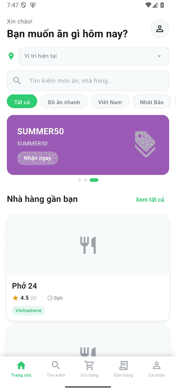 |
| Driver đăng nhập → Trang chủ → Thu nhập → Hồ sơ |  |

GIF là preview im lặng đã tối ưu. Admin/Restaurant dùng frame Google Chrome đã review. Customer có cả điều hướng xác thực công khai không nhập credential và luồng đã đăng nhập Trang chủ → Đơn hàng → Cá nhân từ fixture local tổng hợp. Driver dùng bốn ảnh role Android AVD đã kiểm duyệt riêng tư. Không preview nào chứng nhận hành trình production hoặc mobile release.

## Web production có kiểm soát lịch sử

Hai ảnh Google Chrome này thuộc revision đã deploy `17584153ff256b74a3413ae9844f4f27bff038cc`, không phải runtime Railway hiện tại `84eeac3a2845868fc3a7fd45f8a73775e834a09d`. Một smoke GPS API/realtime riêng trên revision hiện tại đã pass, nhưng chứng nhận đủ bốn role trên Chrome và thiết bị vật lý chưa được rerun. Khi chụp, Admin hiển thị bốn user synthetic của role-smoke và một restaurant tạm; queue Restaurant được scope vào restaurant đó và không có đơn. Cleanup sau đó xóa toàn bộ user, profile, restaurant, order và GPS row của fixture. Ảnh chỉ chứng minh hành trình xác thực lịch sử có phạm vi ghi trong manifest.

| Tổng quan Admin đã xác thực | Queue đơn Restaurant đã xác thực |
|---|---|
| 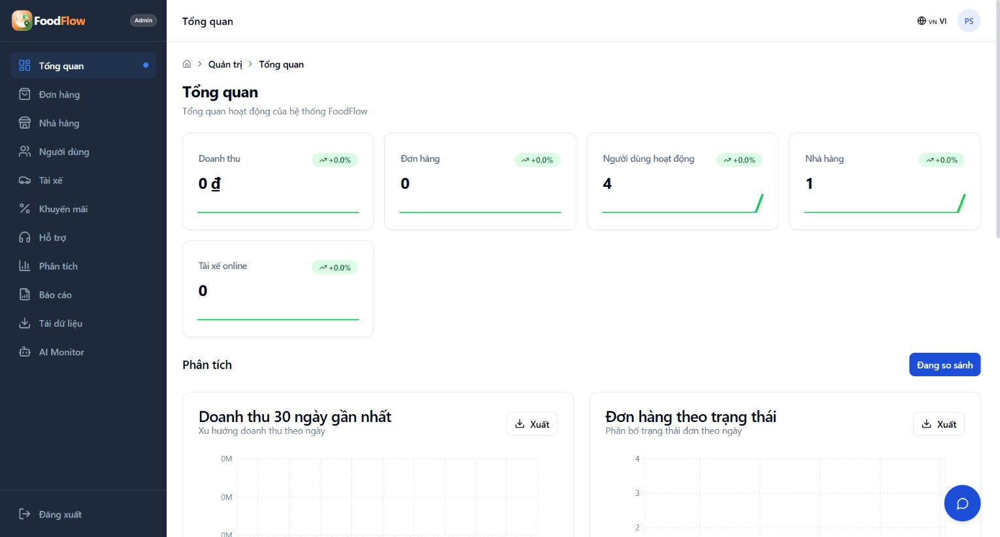 | 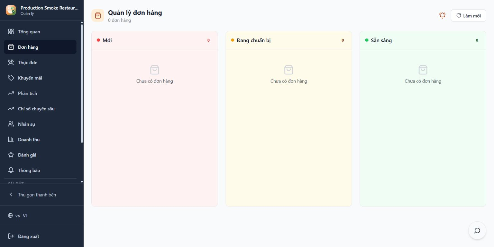 |

## Admin

Xem [hướng dẫn Admin](./admin-guide.vi.md) cho đăng nhập, điều hướng, ranh giới quyền và xử lý lỗi.

| Màn hình | Ảnh |
|---|---|
| Đăng nhập |  |
| Tổng quan |  |
| Đơn hàng |  |
| Nhà hàng |  |
| Người dùng |  |
| Tài xế |  |
| Khuyến mãi |  |
| Hỗ trợ |  |
| Phân tích |  |
| Cài đặt |  |

## Restaurant

Xem [hướng dẫn Restaurant](./restaurant-guide.vi.md) cho đơn hàng, menu, quyền staff, settings và xử lý lỗi.

| Màn hình | Ảnh |
|---|---|
| Đăng nhập |  |
| Dashboard |  |
| Hàng đợi đơn |  |
| Thực đơn |  |
| Khuyến mãi |  |
| Doanh thu |  |
| Đánh giá |  |
| Nhân sự |  |
| Insight |  |
| Cài đặt |  |

## Customer

Customer là sản phẩm Flutter/Riverpod native Android/iOS hạng nhất. Khởi chạy từ [`main_customer.dart`](../mobile/lib/main_customer.dart) với Android flavor `customer`. Phạm vi đã tài liệu hóa gồm discovery, ordering, cart, checkout, tracking và support; xem [hướng dẫn Khách hàng](./customer-guide.vi.md) cho hành trình sử dụng và [hướng dẫn mobile](../mobile/README.md) để biết runtime/build.

Xem workflow Customer/Driver dùng chung, permission, hành vi thông báo và lệnh chạy ở [hướng dẫn Customer và Driver](./customer-driver-guide.vi.md).

Media Android AVD đã review riêng tư dưới đây gồm luồng auth công khai, luồng fixture đã xác thực Trang chủ → Đơn hàng → Cá nhân và hành trình Customer local qua nhà hàng gần đây, menu, giỏ hàng, checkout và tracking. GPS là dữ liệu HCMC mô phỏng cố định; UI giữ lại không hiện tọa độ chính xác. Manifest ghi working tree dirty, nên đây chỉ là evidence regression/product; cần capture clean head mới cho release.

### Xác thực công khai và mở ứng dụng Customer


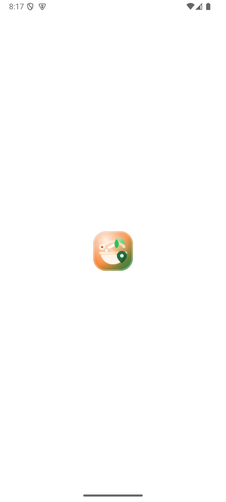

### Customer đã xác thực với fixture local


| Trang chủ và nhà hàng gần | Đơn đang hoạt động | Cá nhân |
|---|---|---|
| 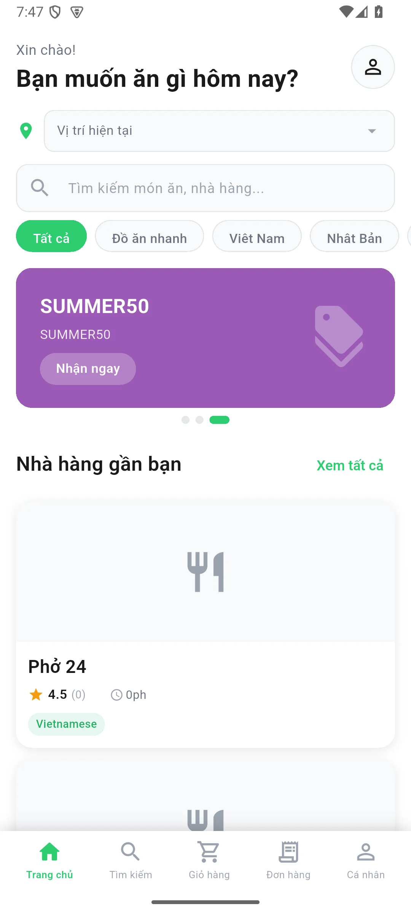 | 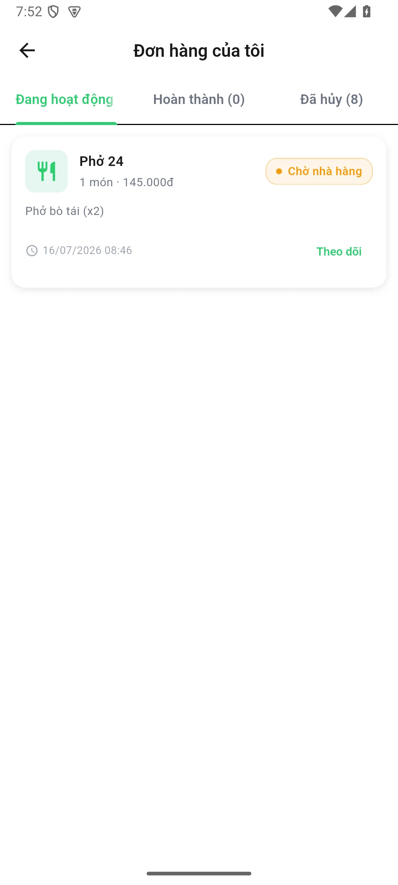 | 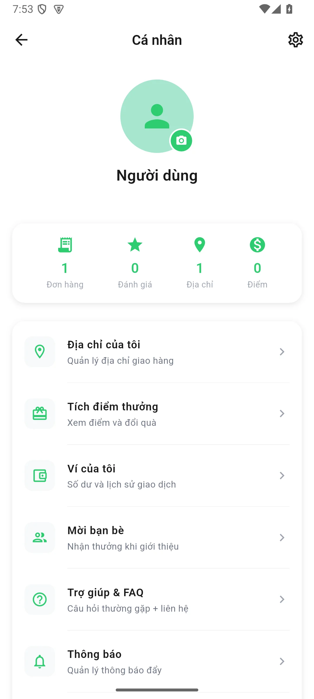 |

Ảnh Đơn hàng là evidence trực quan sau-fix: enum backend `restaurant_pending` được hiển thị thành `Chờ nhà hàng`, không lộ key nội bộ. Test tập trung kiểm tra riêng đủ 15 giá trị `OrderStatus` của backend bằng tiếng Anh, Việt, Nhật và fallback đã localize cho trạng thái chưa biết. Các frame chỉ chứa fixture local synthetic, không chứng nhận production/release.

### Hành trình đặt món Customer

| Nhà hàng gần đây | Menu nhà hàng | Giỏ hàng |
|---|---|---|
| 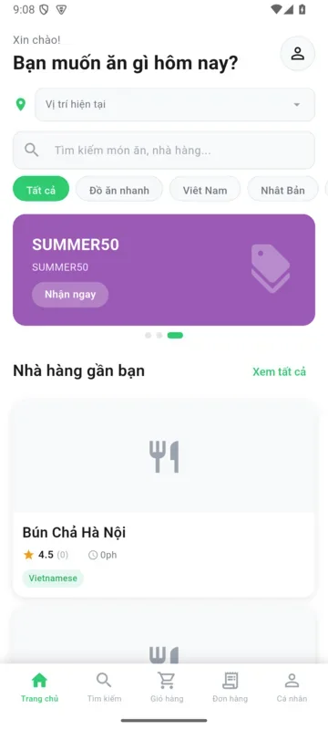 | 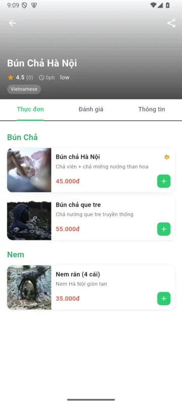 | 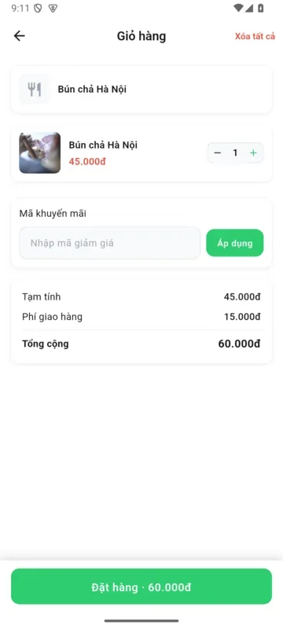 |

| Checkout | Theo dõi đơn |
|---|---|
| 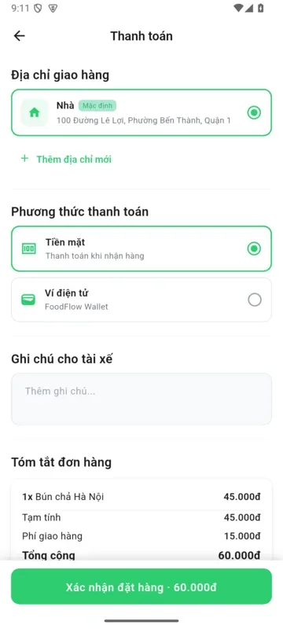 |  |

Response HTTP 201 của checkout hiện trả contract đã serialize để model mobile nhận số đúng kiểu và chuyển sang tracking. Ảnh tracking giữ trạng thái degraded/trung thực khi chưa có tài xế, không bịa vị trí.

## Driver

Driver là sản phẩm Flutter/Riverpod native Android/iOS. Khởi chạy từ [`main_driver.dart`](../mobile/lib/main_driver.dart) với Android flavor `driver`. Xem [hướng dẫn Tài xế](./driver-guide.vi.md) cho đăng nhập, onboarding, Online thật, dispatch, thu nhập và hồ sơ; xem [hướng dẫn mobile](../mobile/README.md) cho runtime/build.


| Đăng nhập | Trang chủ |
|---|---|
| 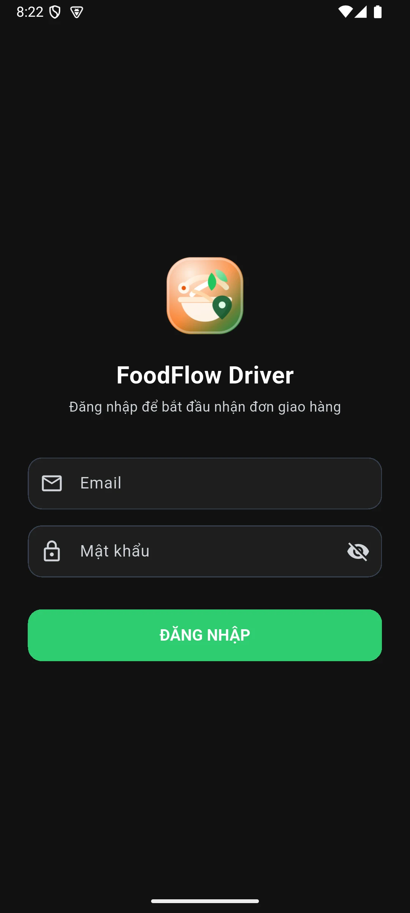 | 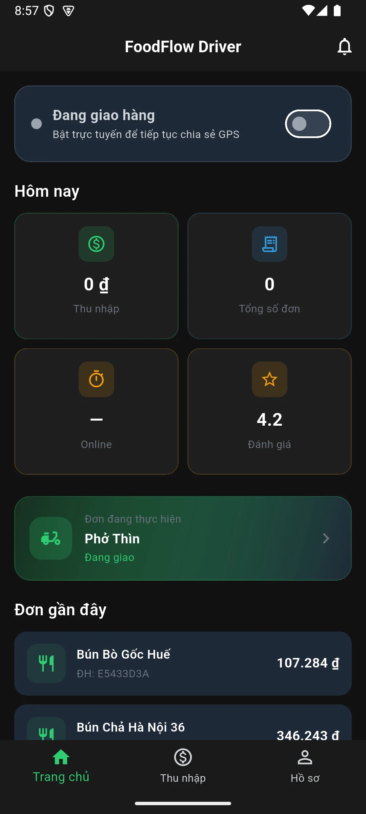 |

| Thu nhập | Hồ sơ |
|---|---|
| 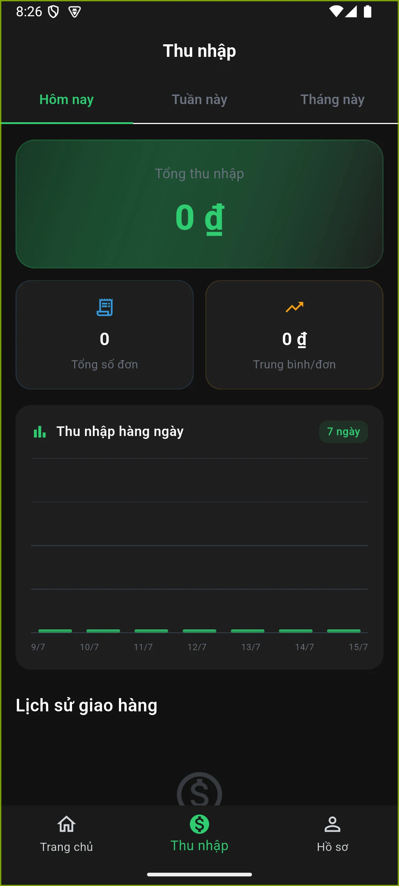 | 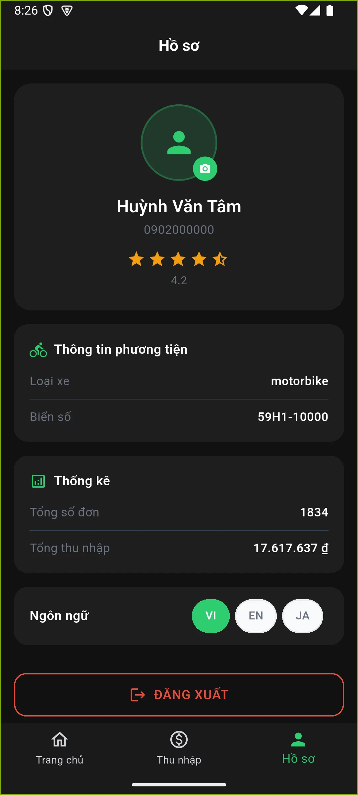 |

### Offer dispatch realtime

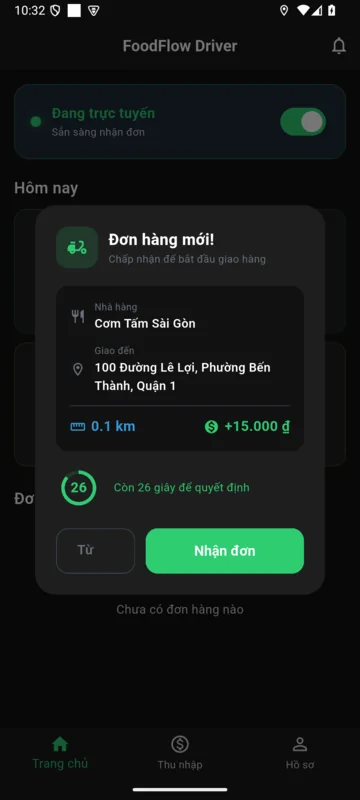

Ảnh local API 35 cho thấy order đã được Restaurant chấp nhận và offer đến Driver đang Online. Offer hết hạn không nhận nên backend hủy theo timeout policy bình thường; không phải đơn production.

### GPS và foreground tracking local E2E

Ảnh Android API 35 dùng route mô phỏng và dữ liệu test deterministic. Chúng minh họa thao tác Online, notification permission và foreground location notification của Driver; không hiển thị vị trí thật, tài khoản cá nhân, credential, token hoặc thông báo cá nhân không liên quan.

Local E2E lịch sử đã nhận GPS command xác thực, làm mới Redis liveness, ghi mẫu vào PostGIS và gửi một event Socket.IO cho Admin được cấp quyền. Đây chỉ là bằng chứng compatibility `socketio` local, không phải Supabase, Railway, Vercel hoặc production.

| Màn hình | Ảnh |
|---|---|
| Driver Online sau GPS verification |  |
| Driver Online trong emulator smoke hiện tại | 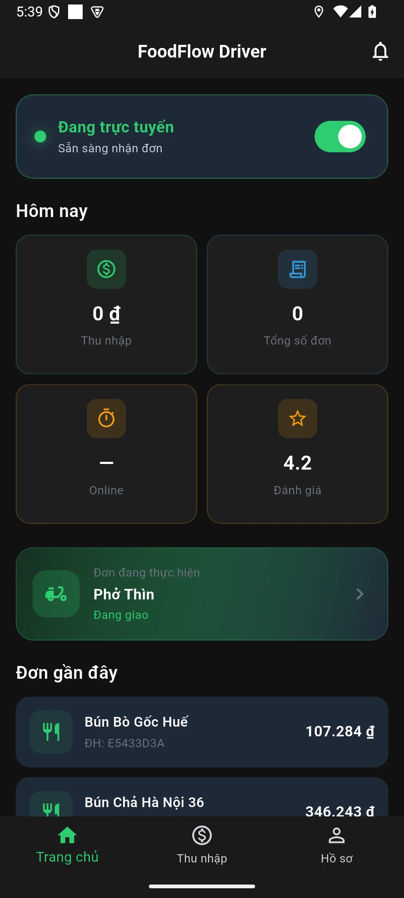 |
| Quyền notification foreground tracking |  |
| Foreground location notification | 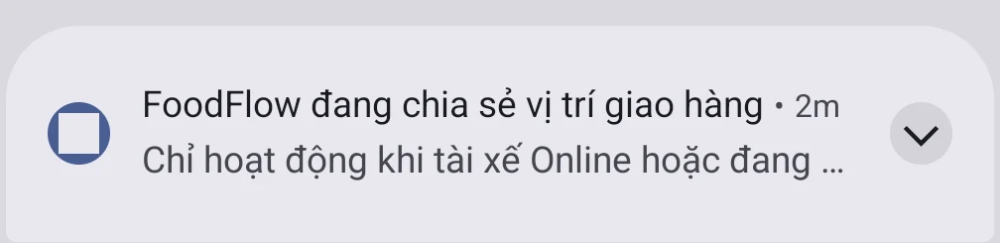 |

### Recovery production-emulator Android API 35

Một smoke riêng ngày 15/07/2026 dùng Driver synthetic tạm trên Android API 35 với Railway và Supabase. Lượt có phạm vi này ghi nhận foreground tracking sau thao tác Online, cập nhật khi tắt màn hình, buffer offline giữ timestamp gốc, flush khi có mạng, refresh/restart sau process termination, PostGIS và private Broadcast được cấp quyền. Tài khoản và GPS row tạm đã được xóa. Đây là evidence từ một lượt có phạm vi trên backend/provider production bằng Android emulator; không chứng nhận thiết bị vật lý, iOS, FCM, payout, routing, app-store hay production rộng hơn.

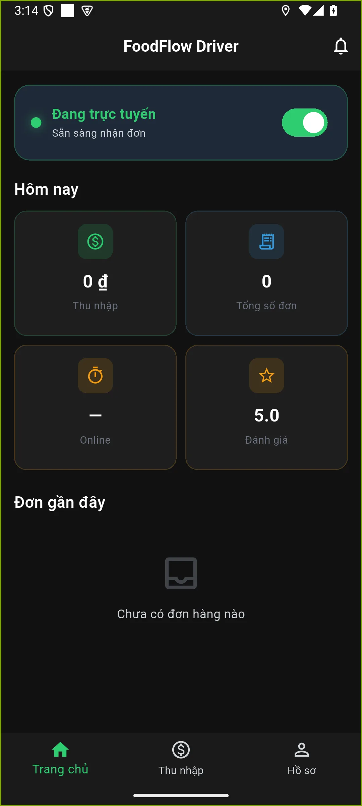

## Tạo lại

```powershell
docker compose -f docker-compose.yml -f docker-compose.e2e.yml up -d --build
$env:FOODFLOW_ADMIN_URL='http://localhost:13000'
$env:FOODFLOW_RESTAURANT_URL='http://localhost:13002'
$env:FOODFLOW_API_URL='http://localhost:13001/api'
node docs/scripts/capture-product-media.mjs
```

Dùng `localhost`, không dùng `127.0.0.1`, vì overlay CORS cố ý xem host sau là error-state. Script dùng API thật, Google Chrome channel, tạo GIF tối ưu và xóa frame trung gian nhưng vẫn phải review từng ảnh. Capture dùng cho release phải kèm source commit, Compose/image reference và nêu rõ clean final head hay dirty workspace. Manifest hiện tại ghi Android API 35 x86_64 AVD cho mobile, seed identity deterministic, mật khẩu che, GPS mô phỏng cố định và không dùng Google Maps API key. Bản đồ web Admin/Restaurant chỉ chấp nhận OpenFreeMap không cần key; không gắn nhãn OpenFreeMap cho widget mobile.

Checklist: locale/title/`html lang`, không có 404/`Failed to fetch`/console error, data thật từ API, không lộ secret/token, không có crop/clipping và không che lỗi thành empty state. Media hiện có vẫn là lịch sử cho tới khi recapture từ release candidate đã commit và ghi source/runtime reference; capture từ dirty workspace chỉ là runtime evidence, không phải release proof.

Xem [gallery EN chi tiết](product-gallery.md), [testing](testing-guide.vi.md), [Docker](docker-local-dev-guide.vi.md).
