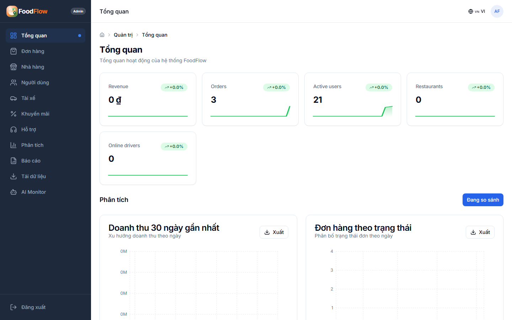
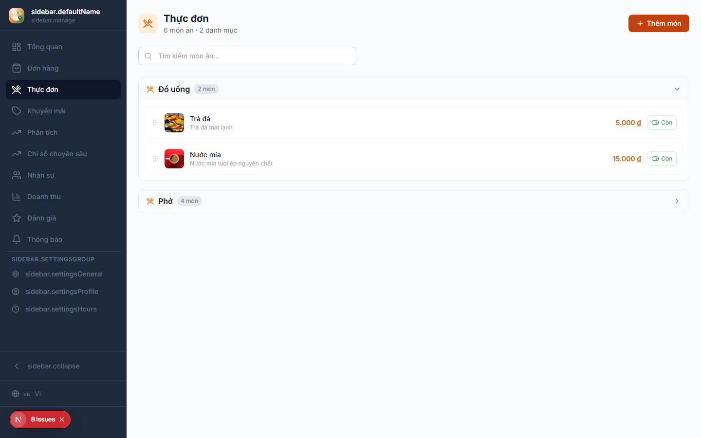
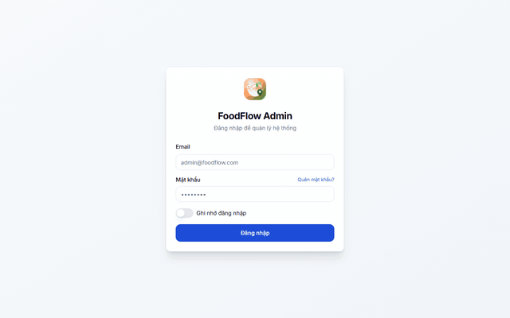
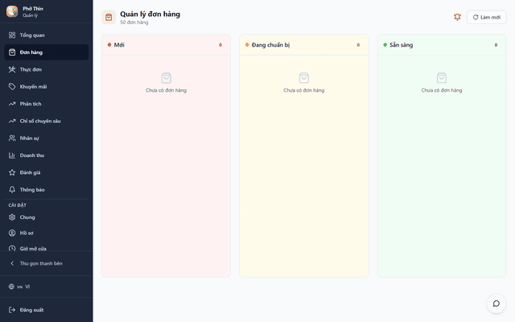
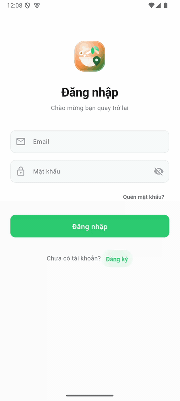
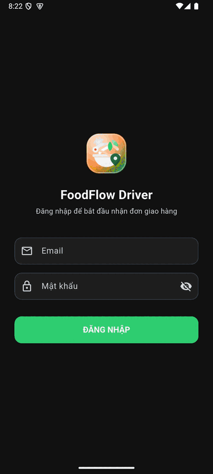

# FoodFlow — フードデリバリー運用プラットフォーム

言語: [English](../README.md) · [Tiếng Việt](readme.vi.md) · **日本語**

FoodFlow は NestJS API、Admin/Restaurant Web、Flutter Customer/Driver を持つ multi-tenant フードデリバリーシステムです。Managed production は Supabase（PostgreSQL/PostGIS、Realtime、Storage）、Railway（API、worker、migrator、Redis）、Vercel（Admin、Restaurant）を使用します。Docker Compose は local/self-hosted 用に Socket.IO、Redis/BullMQ、MinIO の互換 profile を維持します。

> **2026-07-16 status:** runtime SHA `a703ece61e66dcfe7f308cbf46a98098983233e7` は Railway API/worker/migrator と両 Vercel apps で稼働中です。CI、E2E、Integration Smoke、security、SBOM、build、multi-architecture runtime smoke、8 image scans は green、Prisma は 41 migrations すべて適用済みで pending はありません。API health/readiness と Admin/Restaurant health は同じ SHA を返し、database、Redis、Supabase Storage は ready です。Authenticated GPS/Supabase smoke（ES256、private Broadcast RLS、PostGIS、rejection reason、cleanup）も pass しました。Public Restaurant request は custom domain 不在のため Vercel SSO に redirect されます。Candidate migration 42 と hardened recovery controller は未 deploy です。Google Chrome Admin/Restaurant と Customer/Driver API checks は historical SHA `17584153` の role-smoke evidence で、`a703ece` certification ではありません。Physical Android/iOS、controlled-device FCM、active-order、full browser journeys は未認証です。

## Product preview

FoodFlow には 4 つの product surface があります。[Admin](admin-guide.ja.md)、[Restaurant](restaurant-guide.ja.md)、[Customer](customer-guide.ja.md)、[Driver](driver-guide.ja.md) の guide を選び、[full gallery](product-gallery.ja.md) と [mobile overview](customer-driver-guide.ja.md) を参照してください。Manifest は source head、runtime、capture time、privacy boundary を記録します。Web media は isolated local E2E stack の Google Chrome、mobile media は Android API 35 x86_64 AVD 上の Flutter debug APK で取得しました。すべて dirty working tree/local image の local product/regression evidence であり、production/release certification ではありません。

| Surface    | Runtime                          | 現在の visual evidence                   | 製品の確認方法                                                                                            |
| ---------- | -------------------------------- | ---------------------------------------- | --------------------------------------------------------------------------------------------------------- |
| Admin      | Next.js web dashboard            | Local PNG 10 枚と GIF 1 件                | [Admin ガイド](admin-guide.ja.md)を読み、Admin web を起動。                                               |
| Restaurant | Next.js web dashboard            | Local PNG 10 枚と GIF 1 件                | [Restaurant ガイド](restaurant-guide.ja.md)を読み、Restaurant web を起動。                                |
| Customer   | Flutter/Riverpod Android/iOS app | Privacy-reviewed local WebP 1 枚と GIF 1 件 | [Customer ガイド](customer-guide.ja.md)を読み、device/emulator で `main_customer.dart` を起動。            |
| Driver     | Flutter/Riverpod Android/iOS app | Role/GPS WebP 6 枚、tracking asset 2 件、GIF 1 件 | [Driver ガイド](driver-guide.ja.md)を読み、`main_driver.dart` を起動。                                  |

Mobile captures は simulated GPS と local stack を使用し、manifest は dirty workspace と明記します。Release evidence には final clean head の device/emulator recapture が必要です。Local evidence を production として扱いません。

<p align="center">
  
  
</p>

| Flow | Preview |
|---|---|
| Admin login → overview |  |
| Restaurant orders → menu |  |
| Customer sign-in → registration → sign-in |  |
| Driver sign-in → Home → Earnings → Profile |  |

## Applications

| Surface    | Source                                                   | Runtime                                          | Local URL                                  | Primary guide                                           |
| ---------- | -------------------------------------------------------- | ------------------------------------------------ | ------------------------------------------ | ------------------------------------------------------- |
| API        | `backend/`                                               | NestJS 11, Prisma 6                              | `http://localhost:3001/api`                | —                                                       |
| Admin      | `web/apps/admin/`                                        | Next.js 15, React 18                             | `http://localhost:3000`                    | [Admin ガイド](admin-guide.ja.md)                        |
| Restaurant | `web/apps/restaurant/`                                   | Next.js 15, React 18                             | `http://localhost:3002`                    | [Restaurant ガイド](restaurant-guide.ja.md)              |
| Customer   | [`main_customer.dart`](../mobile/lib/main_customer.dart) | Flutter/Riverpod native mobile app (Android/iOS) | device/emulator; Android `customer` flavor | [Customer（注文者）ガイド](customer-guide.ja.md)        |
| Driver     | [`main_driver.dart`](../mobile/lib/main_driver.dart)     | Flutter/Riverpod native mobile app (Android/iOS) | device/emulator; Android `driver` flavor   | [Driver ガイド](driver-guide.ja.md)                      |

Customer と Driver に local web URL はありません。明示的な Flutter entrypoint を使用し、下記の `--flavor` command は Android product flavor を選択します。

Web route は `vi`、`en`、`ja` の `/:locale` prefix を使用します。API success は `{ success: true, data, meta? }`、error は RFC 7807 Problem Details です。

## Main capabilities

- Customer ordering、cart、address、voucher、wallet/COD/SePay、review、support、AI。
- Driver online/dispatch、fresh GPS validation、route/ETA、heatmap、earnings、KYC、incentive。
- Restaurant order kanban、menu/options、promotion、revenue、review、notification、staff、opening hours、insight。
- Admin KPI、order、restaurant、user、driver、live map、promotion、audit、support、export、AI telemetry。
- Restaurant staff、realtime channel、tracking、export、admin resource の tenant isolation。
- Basemap は key/billing 不要の MapLibre/OpenFreeMap を使用し、GPS・route・ETA は実 backend telemetry のみを使って不足時は fail closed。
- DeepSeek は backend adapter 経由です。Key 不足または provider error は fail closed とし、実 telemetry を保存し、client/repo に key を埋め込みません。

Google Maps は起動要件ではありません。Google Directions と owned OSRM の両方が未設定の場合、route calculation は `503 DIRECTIONS_PROVIDER_NOT_CONFIGURED` を返しますが、API/worker は healthy のままです。DeepSeek credential がないため、Railway は現在 `RAG_ENABLED=false` です。

## Provider architecture

| Concern     | Managed production                 | Local/self-hosted                  |
| ----------- | ---------------------------------- | ---------------------------------- |
| Database    | Supabase PostgreSQL/PostGIS        | PostGIS container                  |
| Realtime    | `REALTIME_PROVIDER=supabase`       | `socketio`                         |
| Storage     | `STORAGE_PROVIDER=supabase`        | `minio`                            |
| Queue       | `QUEUE_PROVIDER=supabase-postgres` | `bullmq`                           |
| Web basemap | MapLibre + OpenFreeMap             | Same provider or self-hosted style |

Managed mode では Admin、Restaurant、Customer、Driver が `POST /api/realtime/token` から短時間・tenant scoped credential を取得します。Mobile の GPS/dispatch decision は authenticated REST で送信し、server が JWT で許可された channel に private Supabase Broadcast を送信します。Socket.IO は explicit local/self-hosted provider のみです。

## Current Docker release — SHA a703ece

Docker Hub の SHA、`v0.1.2`、`latest` aliases は 4 images すべてで digest が一致します。GHCR SHA manifests は public かつ同一 digest です。Provider が manifest write を `401 Unauthorized` で拒否したため、GHCR semver/`latest` promotion は claim しません。

| Artifact | Docker Hub digest |
| --- | --- |
| `foodflow-backend` | `sha256:621fc5be66f102f46cc0f9982488b3d417a660ee46cb4a60e24c6b8e122c158b` |
| `foodflow-migrate` | `sha256:5cae801324ae727bb8db2f8cb8a5ace98afa93e65f8e940aa7347ab4e0013581` |
| `foodflow-admin` | `sha256:ce41f8f63cd4c495742b5f1f240705d9488976641975f300164e20ea06a13ab3` |
| `foodflow-restaurant` | `sha256:84009fc61789a4f0d176b0b433675dc99ff30f533387787cfeaa5d4c21bde7ce` |

Worker は backend image の `dist/workers/main.js` を使用し、別 release artifact ではありません。Old candidate evidence は [release report](batch4-release-report.md) に保持し、新しい rollout の source には使用しません。

## Local development

Node.js 22.13+、pnpm 11.11.0、Docker、Flutter SDK が必要です。実 secret は ignored `.env` または secret manager のみに保存します。

```bash
docker compose up -d postgres redis minio

cd backend
corepack pnpm install --frozen-lockfile
corepack pnpm prisma generate
corepack pnpm prisma migrate dev
corepack pnpm db:seed
corepack pnpm start:dev

cd ../web
corepack pnpm install --frozen-lockfile
corepack pnpm dev

cd ../mobile
flutter pub get --enforce-lockfile
flutter run --flavor customer -t lib/main_customer.dart
flutter run --flavor driver -t lib/main_driver.dart
```

Full stack は `docker compose up -d --build`。Health は API `:3001/api/healthz`、Admin `:3000/api/healthz`、Restaurant `:3002/api/healthz` です。

## Secrets and security

- Chat、log、screenshot、ticket、git history に貼られた key は exposed として production 前に rotate します。
- `.env`、database URL、service-role key、JWT secret、private key、provider token、mobile signing file を commit しません。
- OpenFreeMap は browser key/billing 不要です。Supabase anon/publishable key は RLS と適切な origin control を必須とします。
- DeepSeek、Supabase service role/JWT、SePay、SMTP、FCM、Twilio、deploy credential は server-side secret manager のみです。

```powershell
powershell -File infra/scripts/supabase-preflight.ps1
powershell -File infra/scripts/vercel-web-preflight.ps1
```

## Test gates

```powershell
powershell -File infra/scripts/local-release-gate.ps1 -RunE2E
```

Gate は frozen install、Prisma、backend typecheck/lint/Jest/build、web typecheck/ESLint/Vitest/build、OpenAPI Spectral、Compose、Playwright Chromium/Firefox、Flutter analyze/test、secret scan を含みます。Release にはさらに axe serious/critical = 0、visual、tenant isolation、realtime auth、shipper map/route、AI smoke、multi-arch image scan が必要です。

2026-07-14 の clean-volume Docker project `foodflow-batch4-e2e` は当時 current の 36 migrations を適用し、users 201、restaurants 50、menu items 352、orders 509、reviews 123 を seed、RAG documents 402 件を index し、Playwright 204/204 を 353 秒で pass しました。Migrations 37–38 と mobile fixes の後、disposable fresh database は全 38 と default-address invariant を passし、`flutter analyze` は clean、Customer/Driver full suite は 369 tests を passしました。Final clean head の full Docker/Playwright 再実行が必要で、remote provider、deployed image、Firebase live delivery は未検証です。

## Deploy order

1. Exposed key を rotate し、設定済み Railway/provider values は sealed secret store のみに保持。
2. 承認された production migration environment で全 migration を apply/verify する。local Docker から provider state を推測しない。
3. Verified Railway API/worker deployments を保持し、次回 release は同一 immutable SHA から deploy して health/readiness/worker polling を再確認。
4. Live API 経由で private Broadcast allow/deny、token refresh、Storage、GPS snapshot/delta/reconnect、tenant isolation を smoke。
5. Current Railway API に対して exact Admin/Restaurant Vercel deployments、configured map/route、chatbot、notification、export、payment、controlled-device FCM を smoke。
6. Private Admin/Restaurant GHCR packages を repository に接続して workflow write を付与し、4 immutable SHA images を publish/pull/scan。
7. Production smoke green 後のみ `latest` を promote。

## Documentation

- [Admin ガイド](admin-guide.ja.md) — platform operation、support、report、export、settings
- [Restaurant ガイド](restaurant-guide.ja.md) — orders、menu、staff permission、revenue、settings
- [Customer（注文者）ガイド](customer-guide.ja.md) — ordering、permission、地図での住所選択、checkout、tracking、support
- [Driver ガイド](driver-guide.ja.md) — onboarding、Online/GPS、dispatch、earnings、profile
- [Product gallery](product-gallery.ja.md) と [mobile overview](customer-driver-guide.ja.md)
- [Architecture (EN)](system-architecture.md)
- [Project overview and requirements](project-overview-pdr.ja.md)
- [API contract](api-contract.ja.md)
- [Deployment](deployment-guide.ja.md)
- [Docker/local](docker-local-dev-guide.ja.md)
- [Testing](testing-guide.ja.md)
- [AI chatbot](ai-chatbot-guide.ja.md)
- [Security](security-audit-guide.ja.md)
- [Roadmap](project-roadmap.ja.md)
- [Branch disposition (EN)](branch-disposition.md)
- [Batch 4 report (EN)](batch4-release-report.md)

## Branch policy

Remote branch は `master` のみです。Historical local integration/finalization ref と linked integration worktree は残っていません。Branch equivalence は release approval ではありません。Historical integration branch を再作成、raw merge、名前付き push しません。

## License

[MIT](../LICENSE)
