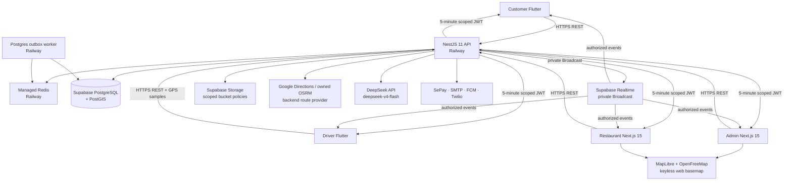
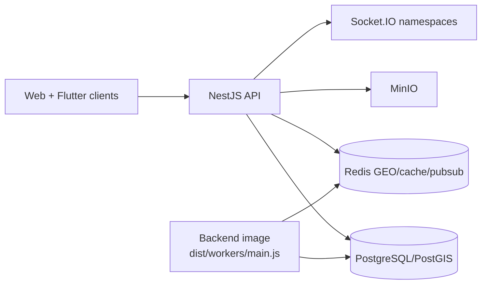
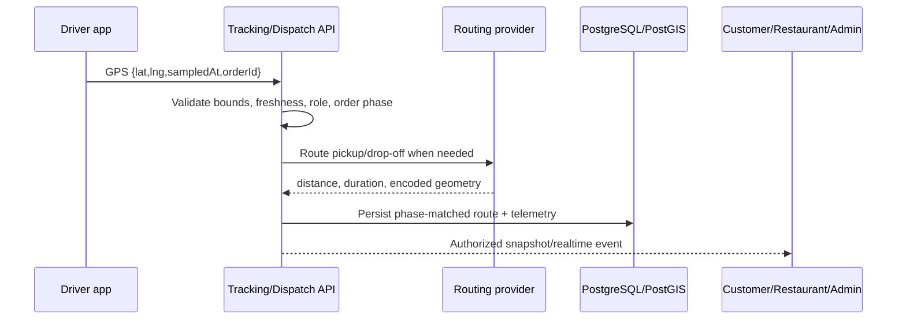

# FoodFlow System Architecture

## Overview

FoodFlow is a modular-monolith delivery platform with four user-facing client surfaces: Admin web, Restaurant web, Customer Flutter, and Driver Flutter. The NestJS API and worker are shared service surfaces, not user-facing applications. The managed-production target is Supabase + Railway + Vercel; Docker Compose is an explicit local/self-hosted compatibility topology rather than the production source of truth.

Current schema includes ordered Prisma migrations for PostGIS delivery geometry, private Broadcast authorization, job/dispatch outboxes, private driver KYC, audit/export records, and AI usage telemetry.

## Managed-production topology



The API can run without a long-lived WebSocket server when `REALTIME_PROVIDER=supabase`. Scheduled work is persisted in PostgreSQL and drained by the Railway worker when `QUEUE_PROVIDER=supabase-postgres`; the secured endpoint is retained for recovery and one-off operation.

## Local and self-hosted topology



This topology uses `REALTIME_PROVIDER=socketio`, `STORAGE_PROVIDER=minio`, and `QUEUE_PROVIDER=bullmq`. It is useful for development, E2E, and self-hosting, but its environment values must never be reused as managed-production defaults.

## HTTP and authentication boundaries

- Global REST prefix: `/api`.
- Success: `{ success: true, data, meta? }`.
- Failure: RFC 7807 Problem Details with a stable application `code`.
- Access and refresh JWTs are distinct; browser clients serialize refresh and block refresh loops.
- RBAC guards enforce `admin`, `restaurant`, `driver`, and `customer` boundaries.
- Restaurant access additionally requires an active `RestaurantProfile` for the target tenant.
- Tracking access is order-participant scoped: owner customer, assigned driver, active staff for the order restaurant, or admin.

See [API contract](api-contract.md) and [OpenAPI](openapi.yaml).

## Customer and Driver mobile runtimes

| Role | Canonical entry point | Runtime | Boundary |
|---|---|---|---|
| Customer | [`mobile/lib/main_customer.dart`](../mobile/lib/main_customer.dart) | Flutter/Riverpod; Android `customer` product flavor; iOS Runner target | Configures Customer notification navigation, then starts the Customer app. API mutations use authenticated HTTPS; managed realtime is private, scoped Broadcast. |
| Driver | [`mobile/lib/main_driver.dart`](../mobile/lib/main_driver.dart) | Flutter/Riverpod; Android `driver` product flavor; iOS Runner target | Configures Driver notification navigation, then starts the Driver app from `mobile/lib/driver/main_driver.dart`. GPS and dispatch use authenticated HTTPS; managed realtime is private, scoped Broadcast. |

Neither mobile role has a public web route. The Android launch commands must keep the explicit flavor and entrypoint paired: `flutter run --flavor customer -t lib/main_customer.dart` and `flutter run --flavor driver -t lib/main_driver.dart`.

## Supabase Realtime contract

```mermaid
sequenceDiagram
    participant Client as Admin/Restaurant/Customer/Driver
    participant API as NestJS API
    participant DB as Supabase Postgres
    participant RT as Supabase Realtime

    Client->>API: POST /api/realtime/token {orderId?, restaurantId?}
    API->>DB: Lock active user FOR SHARE; verify role and requested scope
    API-->>Client: ES256 JWT, expiresAt, allowed channels
    Client->>RT: setAuth(token) + subscribe to private channel
    API->>RT: Broadcast(channel,event,payload)
    RT-->>Client: Event only when realtime.messages policy allows channel claim
```

The JWT TTL is five minutes. Token signing runs inside a database transaction that holds a shared lock on the active user row and rechecks the role, so account deactivation/deletion cannot overtake an in-flight token issue. Claims contain `sub`, application role, and `realtime_channels`. The private Broadcast policy on `realtime.messages` reads those claims and permits subscribe only to an explicitly allowed channel. `realtime_outbox` remains only for the one-cycle rollback path; broad public channels are not part of the design.

Canonical channel families cover user notifications, admin orders/drivers, restaurant tenants, drivers, orders, and restaurant-driver chat. A requested order or restaurant scope is rejected before token issue when ownership cannot be proven.

Admin, Restaurant, Customer, and Driver managed clients support this contract. Mobile GPS and dispatch decisions remain authenticated REST mutations; Supabase is receive-only for allow-listed business events. Socket.IO remains an explicit local/self-hosted transport.

## Queue and outbox processing

`QUEUE_PROVIDER=supabase-postgres` writes jobs to `job_outbox` with queue, name, JSON payload/options, status, attempts, and `run_at`. The Railway worker drains bounded batches immediately and then polls without overlapping a prior drain. `GET|POST /api/jobs/drain` are recovery/one-off server-to-server routes and require an exact `Authorization: Bearer ${CRON_SECRET}` value.

Local BullMQ remains available. The worker is another entry point in the backend image, not a separate package/image contract.

## Dynamic RAG indexing

The same worker synchronizes approved restaurant and active menu content into `rag_documents`. The indexer reads source rows in cursor-paginated batches, builds canonical text, and compares a SHA-256 `content_hash` before requesting an embedding. Unchanged rows are skipped; changed rows use the configured DeepSeek `text-embedding-v3` provider and are upserted with their real vector. A missing or failed provider leaves the document pending with no vector, never a fabricated embedding.

Source keys and content hashes make reruns idempotent. Stale document deactivation occurs only after the complete scan succeeds, so a partial database/provider failure cannot erase the last usable index. The repository contains no runtime hard-coded FAQ/policy corpus; production knowledge grows from onboarded business data. Local big-seed data is disposable load/coverage evidence and is never copied into Supabase production.

## Notification delivery

Notification fanout persists an in-app record, then enqueues channel-specific work. For push, the worker sends bounded batches through Firebase Admin SDK/FCM HTTP v1. `FCM_PROJECT_ID` identifies the Firebase project; the runtime uses workload credentials/Application Default Credentials when available, or a one-line `FCM_SERVICE_ACCOUNT_JSON` held only in its secret store. The legacy FCM server key is not a supported configuration.

- A rejected provider request is rethrown so the durable queue can retry it; it is not reported as delivery.
- Per-token outcomes return partial success/failure counts. Only permanently invalid registration tokens are marked stale.
- Notification templates are locale-specific and the job carries locale explicitly; missing templates use the documented fallback rather than an invented message.
- Customer and Driver activate the mobile token lifecycle only after authenticated session establishment. The client validates permission and iOS APNs-token readiness before calling `POST /notifications/fcm-token`, replaces a rotated registration, records cleanup intent before registration, and makes a bounded best-effort body-based delete before clearing local auth on logout. Each registration carries a UUID; the API takes a PostgreSQL advisory lock per FCM token, applies a seven-day effective revocation tombstone, and opportunistically removes expired tombstones on normal FCM traffic, so a late registration cannot recreate a logged-out binding. The POST body without a registration ID and the token-in-path DELETE are temporary rolling-upgrade adapters; new clients use the UUID/body contract and the adapters must remain until a minimum mobile version is enforced. The worker sends an Android high-importance channel and APNs sound payload; Android renders foreground messages through the local channel, iOS presents the native foreground alert, and taps accept only local deep links. The open Driver inbox also receives the authenticated realtime record and de-duplicates it by ID. Public Firebase client build metadata is separate from server-side Admin credentials.

Live delivery still requires a controlled device token and the actual production credentials; unit tests cannot establish that provider-side configuration is valid.

## Storage

- Managed production: Supabase Storage through the server-side secret-key client.
- Local/self-hosted: MinIO.
- Driver KYC and proof-of-delivery use the dedicated private `foodflow-private` bucket. The API issues owner-scoped signed uploads, validates stored MIME/signature/ownership, stores only object keys, and gives Admin five-minute signed reads. Public menu, restaurant, avatar, and review assets use `foodflow-public`.
- Public restaurant/menu assets remain separate from private KYC data.
- Restaurant assets are uploaded/deleted through backend authorization; service-role keys are never exposed to clients.
- Storage health follows the selected provider and reports a degraded component instead of silently substituting another provider.

## Maps, dispatch, and shipper tracking



Key invariants:

- Missing, stale, future, malformed, overflowing, or out-of-service-area coordinates are rejected.
- Route geometry is tied to pickup/drop-off phase; wrong-phase data cannot replace the visible route.
- ETA is derived from provider route/traffic data and remaining progress, not an invented speed fallback.
- Driver maps do not center on a hardcoded city when both GPS and valid backend geometry are absent.
- Redis GEO/cache is a local compatibility accelerator; persisted PostGIS/`delivery_tasks.route_geojson` remains the durable route source.

## AI support

The API owns all DeepSeek calls. `DEEPSEEK_MODEL` defaults to `deepseek-v4-flash`; the provider key is server-only. Chat sessions and turns are ownership-checked, usage events persist model/token/cost/latency telemetry, and Admin AI Monitor reads those persisted aggregates. Missing configuration and provider failures return explicit typed states; the system does not fabricate an LLM answer.

Any key previously pasted into chat or logs must be rotated before live smoke or production deploy.

## Tenant and data security

- Prisma queries scope restaurant resources by the authenticated active profile.
- Realtime channel authorization is verified under an active-user shared row lock before ES256 JWT signing and again through the private Supabase Broadcast policy on `realtime.messages`.
- Database foreign keys protect semantic creator/sender/approver and cart-restaurant UUIDs from late-write orphans; fixture cleanup also scans those references before deletion and after its capability-drain window.
- Controlled production role smoke stores a non-secret exact-ID lifecycle row atomically with its fixture. Cleanup moves that row from `active` to `deletion_committed` in the same transaction that deletes identities, holds the advisory lease through the Realtime capability drain, then records `complete`. This tombstone allows recovery after a hard kill without treating an unknown run ID as owned data.
- Public job/telemetry tables enable RLS; the retained realtime outbox is rollback-only and is not a client broadcast source.
- Export jobs are tied to the requesting admin; unsupported Parquet creation is rejected rather than generating fake output.
- Webhooks require provider/generic secrets and replay protection.
- Production environment validation rejects missing keys, example values, local URLs, weak JWT/Cron secrets, and implicit provider fallbacks.

## Internationalization

| Layer | Mechanism | Locales |
|---|---|---|
| Backend | `nestjs-i18n`, request locale + persisted preference | `vi`, `en`, `ja` |
| Admin/Restaurant | URL segment + `next-intl` | `vi`, `en`, `ja` |
| Flutter | generated ARB localizations | `vi`, `en`, `ja` |
| Async jobs | locale serialized into job payload | `vi`, `en`, `ja` |

URL locale is authoritative for web rendering, metadata, `html lang`, labels, and accessibility text. Cookie/session state must not override a fresh locale URL.

## Driver session and availability invariants

The Flutter Driver provider treats login, logout, availability, dispatch, and realtime listeners as one cancellable session. A monotonically changing session epoch prevents awaited work from an invalidated session from writing state after logout or a replacement login. Logout tears down location work, stream subscriptions, order subscriptions, and the realtime connection before it clears local credentials.

Availability has one canonical backend-backed state. A pause presentation is derived only after the offline request succeeds; if that request fails, the Driver remains online and sees an actionable error. Switching availability disables the control during the request, preventing overlapping transitions.

## Dashboard navigation and accessibility

Restaurant navigation is a desktop sidebar and a controlled mobile dialog/drawer rather than two unrelated menus. The shell provides a skip link, labelled icon-only controls, focus management when the drawer opens, `aria-current` for the active route, 44px-or-larger interaction targets, and `motion-reduce` fallbacks. Locale-aware links remain responsible for preserving the URL locale.

## Operational health and release boundaries

- API: `/api/healthz` and `/api/readyz`.
- Admin/Restaurant: `/api/healthz`.
- Railway API health configuration is declared in `backend/railway.toml`; the Railway worker owns recurring job-outbox draining.
- Docker release images are multi-architecture, non-root, digest-promoted, and scanned before semver/latest promotion.
- Supabase/Railway/Vercel deploy is blocked until their preflight scripts pass and current-head local plus remote gates are green. A live FCM controlled-token send and authenticated browser smoke are separate release evidence, not implied by unit tests.

Related decisions: [ADR index](adr/0001-record-architecture-decisions.md), [deployment guide](deployment-guide.md), and [testing guide](testing-guide.md).
