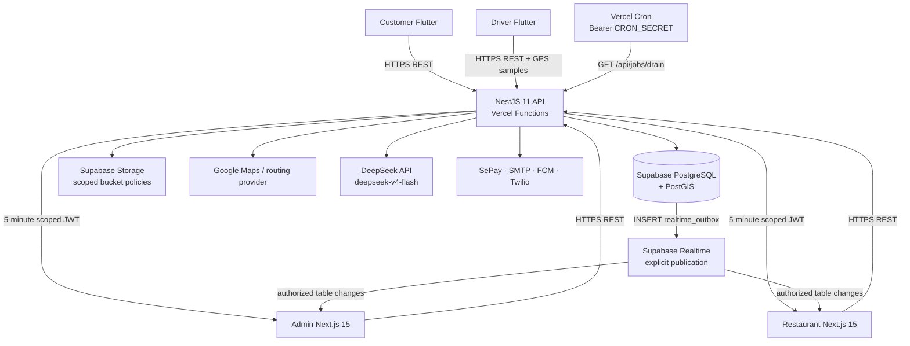
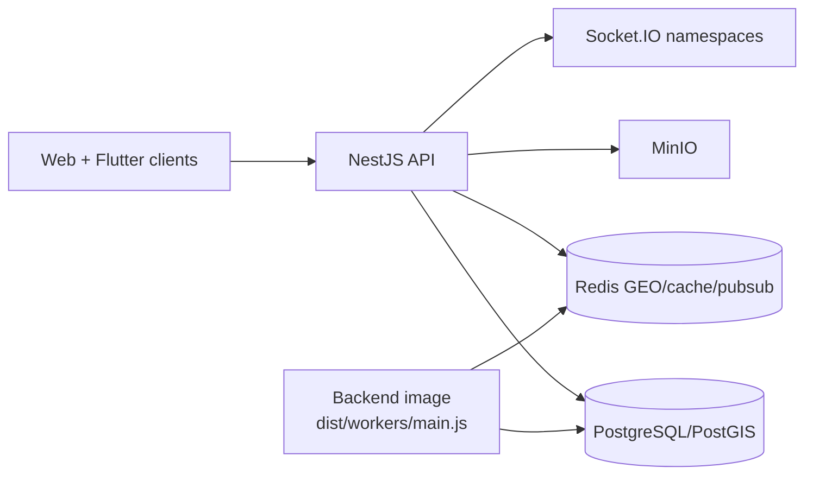
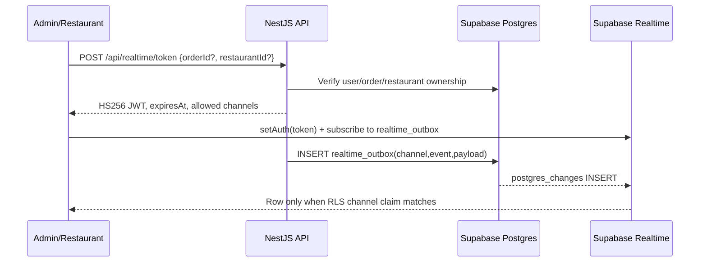
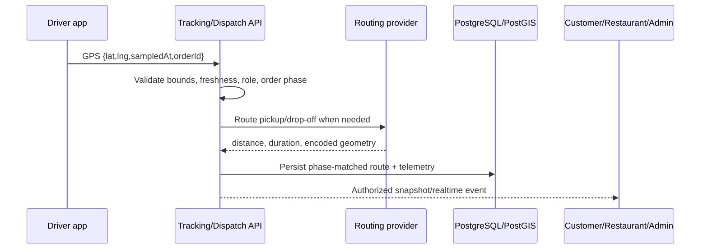

# FoodFlow System Architecture

## Overview

FoodFlow is a modular-monolith delivery platform with five user-facing surfaces: the NestJS API, Admin web, Restaurant web, Customer Flutter app, and Driver Flutter app. The managed-production target is Supabase + Vercel; Docker Compose is an explicit local/self-hosted compatibility topology rather than the production source of truth.

Current schema snapshot (2026-07-10): **54 Prisma models** and **22 ordered migrations**, including PostGIS delivery geometry, realtime/job outboxes, audit/export records, and AI usage telemetry.

## Managed-production topology

The API can run without a long-lived WebSocket server when `REALTIME_PROVIDER=supabase`. Scheduled work is persisted in PostgreSQL and drained by a secured Cron endpoint when `QUEUE_PROVIDER=supabase-postgres`.

## Local and self-hosted topology

This topology uses `REALTIME_PROVIDER=socketio`, `STORAGE_PROVIDER=minio`, and `QUEUE_PROVIDER=bullmq`. It is useful for development, E2E, and self-hosting, but its environment values must never be reused as managed-production defaults.

## HTTP and authentication boundaries

- Global REST prefix: `/api`.
- Success: `{ success: true, data, meta? }`.
- Failure: RFC 7807 Problem Details with a stable application `code`.
- Access and refresh JWTs are distinct; browser clients serialize refresh and block refresh loops.
- RBAC guards enforce `admin`, `restaurant`, `driver`, and `customer` boundaries.
- Restaurant access additionally requires an active `RestaurantProfile` for the target tenant.
- Tracking access is order-participant scoped: owner customer, assigned driver, active staff for the order restaurant, or admin.

See [API contract](api-contract.md) and [OpenAPI](openapi.yaml).

## Supabase Realtime contract

The JWT TTL is five minutes. Claims contain `sub`, application role, and `realtime_channels`. RLS reads those claims and permits `SELECT` only for rows whose channel is explicitly allowed. The `realtime_outbox` table alone is added to `supabase_realtime`; broad public channels are not part of the design.

Canonical channel families cover user notifications, admin orders/drivers, restaurant tenants, drivers, orders, and restaurant-driver chat. A requested order or restaurant scope is rejected before token issue when ownership cannot be proven.

The current Admin and Restaurant clients support this contract. Mobile still uses the Socket.IO compatibility client and remains a production-mobile migration item.

## Queue and outbox processing

`QUEUE_PROVIDER=supabase-postgres` writes jobs to `job_outbox` with queue, name, JSON payload/options, status, attempts, and `run_at`. Vercel Cron calls `GET /api/jobs/drain?limit=50`; secure worker invocations may use `POST /api/jobs/drain`. Both require an exact `Authorization: Bearer ${CRON_SECRET}` value.

Local BullMQ remains available. The worker is another entry point in the backend image, not a separate package/image contract.

## Storage

- Managed production: Supabase Storage through the server-side service-role client.
- Local/self-hosted: MinIO.
- Review photos use signed upload URLs.
- Restaurant assets are uploaded/deleted through backend authorization; service-role keys are never exposed to clients.
- Storage health follows the selected provider and reports a degraded component instead of silently substituting another provider.

## Maps, dispatch, and shipper tracking

Key invariants:

- Missing, stale, future, malformed, overflowing, or out-of-service-area coordinates are rejected.
- Route geometry is tied to pickup/drop-off phase; wrong-phase data cannot replace the visible route.
- ETA is derived from provider route/traffic data and remaining progress, not an invented speed fallback.
- Driver maps do not center on a hardcoded city when both GPS and valid backend geometry are absent.
- Redis GEO/cache is a local compatibility accelerator; persisted PostGIS/`delivery_tasks.route_geojson` remains the durable route source.

## AI support

The API owns all DeepSeek calls. `DEEPSEEK_MODEL` defaults to `deepseek-v4-flash`; the provider key is server-only. Chat sessions and turns are ownership-checked, usage events persist model/token/cost/latency telemetry, and Admin AI Monitor reads those persisted aggregates. Missing configuration and provider failures return explicit typed states; the system does not fabricate an LLM answer.

Any key previously pasted into chat or logs must be rotated before live smoke or production deploy.

## Tenant and data security

- Prisma queries scope restaurant resources by the authenticated active profile.
- Realtime channel authorization is verified before JWT signing and again through Supabase RLS.
- Supabase outbox/job tables enable RLS; service-role policy is separate from authenticated read policy.
- Export jobs are tied to the requesting admin; unsupported Parquet creation is rejected rather than generating fake output.
- Webhooks require provider/generic secrets and replay protection.
- Production environment validation rejects missing keys, example values, local URLs, weak JWT/Cron secrets, and implicit provider fallbacks.

## Internationalization

| Layer | Mechanism | Locales |
|---|---|---|
| Backend | `nestjs-i18n`, request locale + persisted preference | `vi`, `en`, `ja` |
| Admin/Restaurant | URL segment + `next-intl` | `vi`, `en`, `ja` |
| Flutter | generated ARB localizations | `vi`, `en`, `ja` |
| Async jobs | locale serialized into job payload | `vi`, `en`, `ja` |

URL locale is authoritative for web rendering, metadata, `html lang`, labels, and accessibility text. Cookie/session state must not override a fresh locale URL.

## Operational health and release boundaries

- API: `/api/healthz` and `/api/readyz`.
- Admin/Restaurant: `/api/healthz`.
- Vercel Cron is declared in `backend/vercel.json`.
- Docker release images are multi-architecture, non-root, digest-promoted, and scanned before semver/latest promotion.
- Supabase/Vercel deploy is blocked until their preflight scripts pass and current-head local plus remote gates are green.

Related decisions: [ADR index](adr/0001-record-architecture-decisions.md), [deployment guide](deployment-guide.md), and [testing guide](testing-guide.md).
