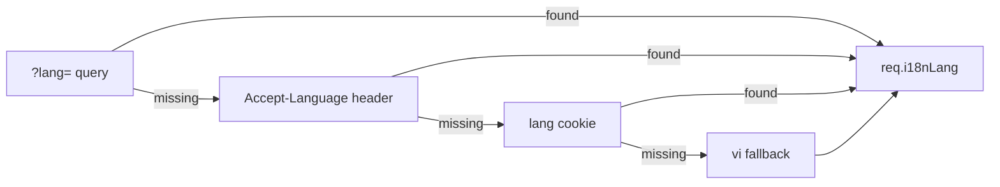

# FoodFlow System Architecture

## High-Level Architecture

FoodFlow is a real-time food delivery platform with 4 client applications, a monolithic NestJS backend (designed for future microservice decomposition), and an AI automation layer.

```
┌─────────────────────────────────────────────────────────┐
│                    CLIENT LAYER                          │
│  Customer App │ Driver App │ Restaurant Web │ Admin Web  │
│   (Flutter)   │ (Flutter)  │   (Next.js)   │ (Next.js)  │
└──────┬────────┴─────┬──────┴───────┬────────┴─────┬─────┘
       │              │              │              │
       └──────┬───────┴──────┬───────┴──────┬───────┘
              │              │              │
       REST + WebSocket      │         REST + WebSocket
              │              │              │
┌─────────────┴──────────────┴──────────────┴─────────────┐
│                   API GATEWAY                            │
│              NestJS (Modular Monolith)                    │
│  Auth │ Orders │ Dispatch │ Tracking │ Admin │ Menu      │
└──────┬──────────┬──────────┬──────────┬─────────────────┘
       │          │          │          │
┌──────┴──────┬───┴──────┬───┴──────┬───┴─────────────────┐
│ PostgreSQL  │  Redis   │  BullMQ  │  MinIO              │
│  + PostGIS  │ (GEO +   │ (Queues) │  (File Storage)     │
│             │  PubSub) │          │                      │
└─────────────┴──────────┴──────────┴──────────────────────┘
```

## Database Design

28 tables across 6 domains:
- **Identity**: users, customer_profiles, driver_profiles, restaurant_profiles
- **Restaurant**: restaurants, opening_hours, categories, menu_items, options
- **Order**: carts, cart_items, orders, order_items, order_status_history, payments, delivery_tasks
- **Location**: addresses, driver_location_history (PostGIS)
- **Social**: reviews, chat_sessions, chat_messages
- **Admin**: promotions, promotion_usages, notifications, ai_support_tickets, admin_audit_logs

## Real-time Architecture

```
Driver GPS (3s interval)
  → WebSocket: driver:location
  → NestJS TrackingGateway
    → Redis GEOADD drivers:active
    → Throttled broadcast to order:{id} room (max 1/2s)
    → Batch INSERT to driver_location_history (15s flush)
  → Customer: interpolated marker animation
  → Fallback: HTTP polling every 10s
```

## Web Integration Contract

Admin and Restaurant dashboards use locale-prefixed Next.js App Router routes (`/[locale]/...`) and share the web API envelope:

- Success: `{ success: true, data, meta? }`
- Error: RFC 7807 Problem Details with stable `code`
- Pagination: collections in `data`, page context in `meta`

The restaurant order flow used by web E2E is the same runtime path as customers: authenticated address lookup, cart item mutation, `POST /orders`, then restaurant status transitions through `/restaurant/orders/:id/status`. Admin order detail pages consume flattened order detail data from the admin resource service so UI fields do not depend on Prisma relation shapes.

## Driver Dispatch Algorithm

1. GEOSEARCH Redis for online drivers within 5km
2. Filter: not busy, heartbeat alive (<30s)
3. Sort: distance ASC, rating DESC
4. Offer to driver with 30s timeout (WebSocket push)
5. On timeout/decline: retry next driver
6. Expand radius if all exhausted (max 10km)
7. BullMQ delayed retry for durability

## i18n Architecture

Three independent layers, each using its ecosystem's canonical tool:

```
User request
  ├─ HTTP: Accept-Language header → cookie 'lang' → User.preferredLocale
  │         ↓ nestjs-i18n sets req.i18nLang
  │         ↓ services call i18n.t('namespace.key', { lang })
  │
  ├─ BullMQ job: caller serialises locale: LocaleCode into job.data
  │              processor reads job.data.locale — never from request context
  │
  ├─ Flutter mobile: device locale → User.preferredLocale
  │                  AppLocalizations.of(context).keyName
  │
  └─ Next.js web: /[locale]/ URL segment → next-intl middleware
                  useTranslations('namespace')('key')
```

Locale resolution chain (backend):



Supported locales: **vi** (default), **en**, **ja**.

`User.preferredLocale` (PostgreSQL `LocaleCode` enum) is the persisted anchor for async jobs and cross-device consistency.

See `docs/i18n-guide.md` for add-locale procedure and translation key conventions.

## Scaling Path

- Current: Monolithic NestJS on Docker Compose
- >1000 orders/day: Extract dispatch into separate service
- >5000 orders/day: Read replicas, Redis Cluster
- >10000 orders/day: Kubernetes, Kafka for events
